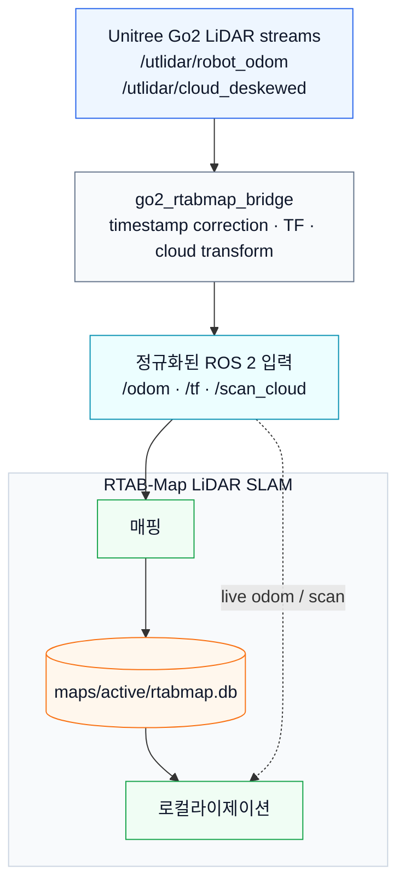

<div align="center">
  <h1>Go2 LiDAR SLAM</h1>
  
  
  
  
  
  
  <p>Unitree Go2를 위한 ROS 2 및 RTAB-Map 기반 LiDAR SLAM 파이프라인.</p>
</div>

<p align="center">
  <a href="README.md">
    
  </a>
</p>

---

## 개요

**Go2 LiDAR SLAM**은 Unitree Go2의 내장 LiDAR odometry와 deskewed point cloud 스트림을 **RTAB-Map**에 연결해 실내 3D LiDAR 매핑과 지도 기반 로컬라이제이션을 수행하는 실제 하드웨어 중심 ROS 2 파이프라인이다.

이 프로젝트의 핵심은 Go2 bare DDS 토픽과 표준 ROS 2 SLAM 도구 사이의 통합 계층이다. 타임스탬프 보정, QoS 호환성, TF 발행, PointCloud2 프레임 변환, RTAB-Map launch 구성, 지도 DB 관리, 반복 가능한 진단 절차를 다룬다. 또한 향후 **Visual SLAM** 트랙을 추가해 현재 LiDAR SLAM baseline과 비교할 수 있도록 구성했다.

---

## 목차

- [개요](#개요)
- [시스템 아키텍처](#시스템-아키텍처)
- [프로젝트 로드맵](#프로젝트-로드맵)
- [사전 요구사항](#사전-요구사항)
- [설치 및 설정](#설치-및-설정)
- [프로젝트 구조](#프로젝트-구조)
- [모듈](#모듈)
  - [1. Go2 RTAB-Map 브릿지](#1-go2-rtab-map-브릿지)
  - [2. LiDAR 매핑](#2-lidar-매핑)
  - [3. 지도 기반 로컬라이제이션](#3-지도-기반-로컬라이제이션)
  - [4. 컨트롤 대시보드](#4-컨트롤-대시보드)
  - [5. 진단 및 테스트](#5-진단-및-테스트)
- [레퍼런스 문서](#레퍼런스-문서)
- [감사의 글](#감사의-글)
- [라이선스](#라이선스)

---

## 시스템 아키텍처

이 스택은 Go2 전용 센서 스트림을 RTAB-Map이 사용할 수 있는 ROS 2 입력으로 변환한다. 브릿지는 odometry와 point cloud의 상대 시간을 유지하고, 누락된 `odom -> base_link` TF를 발행하며, deskewed cloud를 `base_link` 프레임으로 변환한 뒤 RTAB-Map에 전달한다.



---

## 프로젝트 로드맵

- [x] **Phase 1: 프로젝트 스캐폴딩 및 Go2 레퍼런스 정리**
  - ROS 2 패키지 구조, Go2 토픽 레퍼런스, SLAM 설계 문서 작성.
- [x] **Phase 2: Go2 RTAB-Map 브릿지**
  - `/utlidar/robot_odom`을 `/odom`으로 재발행.
  - `odom -> base_link` TF 발행.
  - `/utlidar/cloud_deskewed`를 `/scan_cloud`로 변환.
- [x] **Phase 3: RTAB-Map LiDAR 매핑**
  - 실내용 LiDAR-only RTAB-Map 설정.
  - `maps/active/rtabmap.db`에 지도 DB 생성.
- [x] **Phase 4: 지도 기반 로컬라이제이션**
  - 기존 RTAB-Map DB 로드.
  - 선택적 initial pose 지원.
- [x] **Phase 5: 실제 Go2 검증**
  - 실제 Go2 하드웨어에서 브릿지, 매핑, map 토픽 발행, localization pose 출력 확인.
- [x] **Phase 6: Web dashboard prototype**
  - Python backend 기반 브라우저 매핑/로컬라이제이션 제어 UI.
- [ ] **Phase 7: Known-start localization 안정화**
  - 안정적인 known-start localization을 위한 `ALIGN -> LOCK -> TRACKING` 운용 흐름.
- [ ] **Phase 8: Global relocalization PoC**
  - 더 강한 재위치추정을 위한 Scan Context + ICP 후보 검증.
- [ ] **Phase 9: Visual SLAM 비교 트랙**
  - Visual SLAM baseline을 추가하고 같은 Go2 플랫폼에서 LiDAR SLAM과 비교.

---

## 사전 요구사항

- **OS**: Ubuntu 22.04 LTS
- **ROS 2**: Humble Hawksbill
- **SLAM**: `rtabmap_ros` / `rtabmap_slam`
- **Robot**: 같은 DDS 네트워크에 연결된 Unitree Go2
- **Python**: Python 3
- **선택적 이동 제어**: `/home/cvr/Desktop/sj/go2_ws` 같은 별도 Go2 ROS 2 워크스페이스

Go2 DDS 토픽은 ROS daemon 캐시에 잡히지 않을 수 있다. 원천 Go2 토픽을 확인할 때는 `--no-daemon`을 우선 사용한다.

```bash
ros2 topic list --no-daemon
ros2 topic info /utlidar/robot_odom --verbose --no-daemon
ros2 topic info /utlidar/cloud_deskewed --verbose --no-daemon
```

---

## 설치 및 설정

1. **저장소 클론**:

   ```bash
   git clone https://github.com/leesj24601/go2_lidar_slam.git
   cd go2_lidar_slam
   ```

2. **ROS 2 환경 source**:

   ```bash
   source /opt/ros/humble/setup.bash
   ```

3. **ROS 의존성 설치**:

   ```bash
   sudo apt update
   sudo apt install ros-humble-rtabmap-ros
   rosdep install --from-paths src --ignore-src -r -y
   ```

4. **워크스페이스 빌드**:

   ```bash
   colcon build --symlink-install
   source install/setup.bash
   ```

5. **선택: Go2 이동 제어 워크스페이스 source**:

   SLAM뿐 아니라 Go2 이동 제어까지 필요한 경우에만 source한다.

   ```bash
   source /home/cvr/Desktop/sj/go2_ws/install/setup.bash
   ```

---

## 프로젝트 구조

```text
go2_lidar_slam/
├── COMMANDS.md                         # 짧은 명령 메모
├── SLAM_PLAN.md                        # 상세 구현 계획
├── STATUS.md                           # 현재 상태 및 검증 기록
├── dashboard/                          # Static Web UI 및 Python 제어 backend
├── docs/
│   ├── GO2_REFERENCE.md                # Go2 topic, TF, QoS, timestamp 레퍼런스
│   ├── RUNBOOK.md                      # 빌드, 매핑, 로컬라이제이션, 진단 절차
│   ├── TROUBLESHOOTING.md              # 통합 문제와 해결 기록
│   └── adr/
│       └── 001-slam-tool-selection.md  # 아키텍처 결정 기록
├── maps/
│   ├── active/                         # 현재 active RTAB-Map DB 위치
│   ├── backups/                        # active DB 백업
│   └── sessions/                       # 세션별 RTAB-Map DB
└── src/
    ├── go2_rtabmap_bridge/             # Go2 센서 브릿지 패키지
    └── go2_rtabmap_launch/             # RTAB-Map launch/config 패키지
```

---

> [!IMPORTANT]
> **실행 규칙**: 아래 명령은 별도 디렉터리가 명시되지 않는 한 프로젝트 루트에서 실행한다.

## 모듈

### 1. Go2 RTAB-Map 브릿지

브릿지 노드는 Go2 전용 LiDAR 스트림을 RTAB-Map 입력으로 변환한다.

| 입력 | 출력 | 목적 |
|------|------|------|
| `/utlidar/robot_odom` | `/odom` | 타임스탬프 보정 후 odometry 재발행 |
| `/utlidar/robot_odom` | `/tf` | `odom -> base_link` 발행 |
| `/utlidar/cloud_deskewed` | `/scan_cloud` | 타임스탬프 보정 및 `base_link` 기준 cloud 변환 |

브릿지만 단독 실행:

```bash
source /opt/ros/humble/setup.bash
source install/setup.bash
ros2 run go2_rtabmap_bridge bridge_node
```

다른 터미널에서 브릿지 출력 확인:

```bash
source /opt/ros/humble/setup.bash
source install/setup.bash

ros2 topic hz /odom
ros2 topic hz /scan_cloud
ros2 run tf2_ros tf2_echo odom base_link
```

실기체 기준 기대값:

- `/odom`: 약 150 Hz
- `/scan_cloud`: 약 14.7 Hz
- `tf2_echo odom base_link`: transform 지속 출력

### 2. LiDAR 매핑

기본 active DB 경로로 RTAB-Map 매핑 실행:

```bash
source /opt/ros/humble/setup.bash
source install/setup.bash

ros2 launch go2_rtabmap_launch slam.launch.py
```

명시적인 DB 경로 사용:

```bash
ros2 launch go2_rtabmap_launch slam.launch.py \
  database_path:=/home/cvr/Desktop/sj/go2_lidar_slam/maps/active/rtabmap.db
```

선택한 DB와 SQLite sidecar 파일을 삭제하고 새 지도로 시작:

```bash
ros2 launch go2_rtabmap_launch slam.launch.py reset_db:=true
```

필요할 때 시각화 도구 실행:

```bash
ros2 launch go2_rtabmap_launch slam.launch.py rviz:=true
ros2 launch go2_rtabmap_launch slam.launch.py rtabmap_viz:=true
ros2 launch go2_rtabmap_launch slam.launch.py rviz:=true rtabmap_viz:=true
```

매핑 출력:

| 출력 | 용도 |
|------|------|
| `maps/active/rtabmap.db` | 저장된 RTAB-Map 데이터베이스 |
| `/rtabmap/mapData` | RTAB-Map update 데이터 |
| `/rtabmap/cloud_map` | 누적 3D cloud map |
| `/rtabmap/map` | 2D occupancy grid 출력 |
| `/rtabmap/mapGraph` | Pose graph |
| `/rtabmap/info` | statistics 및 loop closure 정보 |

### 3. 지도 기반 로컬라이제이션

로컬라이제이션은 기존 RTAB-Map DB를 재사용한다.

```bash
source /opt/ros/humble/setup.bash
source install/setup.bash

ros2 launch go2_rtabmap_launch localization.launch.py \
  database_path:=/home/cvr/Desktop/sj/go2_lidar_slam/maps/active/rtabmap.db
```

로봇 시작 위치가 매핑 시작 위치와 많이 다르면 initial pose를 지정할 수 있다.

```bash
ros2 launch go2_rtabmap_launch localization.launch.py \
  database_path:=/home/cvr/Desktop/sj/go2_lidar_slam/maps/active/rtabmap.db \
  initial_pose:="0 0 0 0 0 0"
```

로컬라이제이션 확인:

```bash
ros2 topic hz /rtabmap/localization_pose
ros2 topic echo /rtabmap/localization_pose --once
ros2 node info /rtabmap/rtabmap
```

현재 한계: LiDAR-only RTAB-Map 구성은 known-start localization baseline에 가장 적합하다. kidnapped/global relocalization은 별도의 Scan Context + ICP PoC로 확장할 예정이다.

### 4. 컨트롤 대시보드

대시보드는 매핑과 로컬라이제이션을 브라우저에서 제어하기 위한 UI이다.

<p>
  <a href="https://leesj24601.github.io/lidar-vs-visual-slam/dashboard/">
    
  </a>
</p>

ROS 2와 이 워크스페이스를 source한 뒤 backend 실행:

```bash
source /opt/ros/humble/setup.bash
source install/setup.bash
python3 dashboard/server.py --host 127.0.0.1 --port 8080
```

브라우저에서 열기:

```text
http://127.0.0.1:8080
```

ROS 없이 static preview만 확인:

```bash
cd dashboard
python3 -m http.server 8080
```

API 세부사항은 [`dashboard/README.md`](dashboard/README.md)를 참고한다.

### 5. 진단 및 테스트

빌드 및 테스트:

```bash
source /opt/ros/humble/setup.bash
colcon build --symlink-install
colcon test --event-handlers console_direct+
```

Launch 인자 확인:

```bash
ros2 launch go2_rtabmap_launch slam.launch.py --show-args
ros2 launch go2_rtabmap_launch localization.launch.py --show-args
```

기본 진단 순서:

```bash
ros2 topic hz /utlidar/robot_odom --no-daemon
ros2 topic hz /utlidar/cloud_deskewed --no-daemon
ros2 topic hz /odom
ros2 topic hz /scan_cloud
ros2 run tf2_ros tf2_echo odom base_link
ros2 topic hz /rtabmap/mapData
```

---

## 레퍼런스 문서

- [`SLAM_PLAN.md`](SLAM_PLAN.md): 구현 계획 및 아키텍처 세부사항
- [`STATUS.md`](STATUS.md): 현재 진행 상태, 완료 항목, 한계, 검증 기록
- [`docs/RUNBOOK.md`](docs/RUNBOOK.md): 반복 가능한 빌드, 매핑, 로컬라이제이션, 트러블슈팅 절차
- [`docs/GO2_REFERENCE.md`](docs/GO2_REFERENCE.md): 실측 Go2 topic, QoS, TF, timestamp 동작
- [`docs/TROUBLESHOOTING.md`](docs/TROUBLESHOOTING.md): 증상, 원인, 해결, 검증 명령
- [`docs/adr/001-slam-tool-selection.md`](docs/adr/001-slam-tool-selection.md): SLAM 도구 및 브릿지 아키텍처 선택 기록

---

## 감사의 글

- [ROS 2 Humble](https://docs.ros.org/en/humble/)
- [RTAB-Map ROS](https://github.com/introlab/rtabmap_ros)
- [Unitree Go2](https://www.unitree.com/go2)

---

## 라이선스

현재 ROS 패키지 manifest에는 MIT 라이선스를 사용한다고 명시되어 있다.
