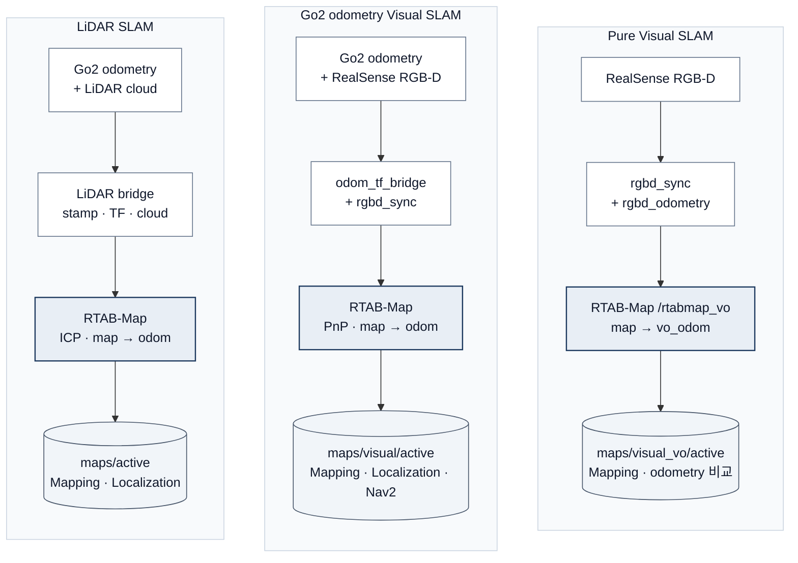

  <h1>Go2 LiDAR & Visual SLAM</h1>
  
  
  
  
  
Unitree Go2에서 LiDAR, Go2 odometry 기반 RGB-D, 순수 RGB-D SLAM을 비교·운용하는 ROS 2 연구 프로젝트

  

  <a href="#overview">개요</a> ·
  <a href="#architecture">아키텍처</a> ·
  <a href="#results">주요 결과</a> ·
  <a href="#quick-start">빠른 시작</a> ·
  <a href="#documentation">문서</a>

---

## 🎯 프로젝트 개요

이 저장소는 Unitree Go2와 RealSense를 RTAB-Map에 연결해 세 가지 SLAM 경로를
실기에서 구현하고 비교한 연구 기록이다.

- Go2 내장 LiDAR와 자체 odometry를 사용하는 **LiDAR SLAM**
- Go2 odometry와 RealSense RGB-D를 결합하는 **Go2 odometry 기반 Visual SLAM**
- Go2 odometry 없이 RGB-D visual odometry를 사용하는 **순수 Visual SLAM**

새로운 SLAM 알고리즘을 제안하기보다 실제 로봇에서 발생하는 센서 시간축 불일치, TF
발행 충돌과 RGB-D·odometry 시각 정합 문제를 해결하고, 세 SLAM 방식의 구성과 주요
파라미터를 실기 결과에 맞춰 검증·조정한다. 각 방식의 동작 범위와 한계는 재현 가능한
코드·설정·실험 기록으로 남긴다. Go2 odometry 기반 Visual 방식은 저장된 RTAB-Map
DB를 사용한 localization과 Nav2 연결까지 포함한다.

## 🔬 연구 초점

| 연구 항목 | 이 저장소에서 다루는 문제 |
|---|---|
| 센서 시간축 정합 | Go2 sensor stamp와 ROS clock 사이 epoch offset을 계산해 odometry와 LiDAR cloud의 상대 시간 관계를 보존 |
| TF 트리·좌표계 통합 | LiDAR·Go2 odometry Visual은 `map → odom → base_link`, 순수 Visual은 `map → vo_odom → base_link` 체인을 구성하고, 전역·지역 TF의 발행 주체를 분리해 센서와 Nav2를 일관된 좌표계로 연결 |
| 세 SLAM 방식의 파라미터 검증 | LiDAR SLAM, Go2 odometry 기반 Visual SLAM, 순수 Visual SLAM의 registration·동기화·처리율 설정을 실기 결과에 따라 각각 검증하고 조정 |
| RGB-D·odometry 시각 정합 | color, aligned depth, CameraInfo를 approximate sync하고 실측한 Go2 odometry 잔여 시간 오차를 보정 |
| 3D mapping·localization·자율주행 검증 | 세 SLAM 방식으로 3D map을 생성하고, LiDAR와 Go2 odometry 기반 Visual에서는 저장된 map을 이용한 localization을, Go2 odometry 기반 Visual에서는 Nav2 목표점 주행까지 실기에서 검증 |

자세한 설계 결정과 데이터 흐름은
[시스템 아키텍처](docs/ARCHITECTURE.md)에 정리돼 있다.

## 🏛️ 시스템 아키텍처

README에서는 세 SLAM 경로를 나란히 놓고, 각 경로의 데이터 흐름을 위에서 아래로
비교한다. 세부 topic 연결과 노드별 책임은 [시스템 아키텍처](docs/ARCHITECTURE.md)에서
확인할 수 있다.

```mermaid
flowchart LR
    subgraph LIDAR["LiDAR SLAM"]
        direction TB
        L1["Go2 odometry<br/>+ LiDAR cloud"]
        L2["LiDAR bridge<br/>stamp · TF · cloud"]
        L3["RTAB-Map<br/>ICP · map → odom"]
        L4[("maps/active<br/>Mapping · Localization")]
        L1 --> L2 --> L3 --> L4
    end

    subgraph VISUAL["Go2 odometry Visual SLAM"]
        direction TB
        V1["Go2 odometry<br/>+ RealSense RGB-D"]
        V2["odom_tf_bridge<br/>+ rgbd_sync"]
        V3["RTAB-Map<br/>PnP · map → odom"]
        V4[("maps/visual/active<br/>Mapping · Localization · Nav2")]
        V1 --> V2 --> V3 --> V4
    end

    subgraph PURE["Pure Visual SLAM"]
        direction TB
        P1["RealSense RGB-D"]
        P2["rgbd_sync<br/>+ rgbd_odometry"]
        P3["RTAB-Map /rtabmap_vo<br/>map → vo_odom"]
        P4[("maps/visual_vo/active<br/>Mapping · odometry 비교")]
        P1 --> P2 --> P3 --> P4
    end

    LIDAR ~~~ VISUAL
    VISUAL ~~~ PURE

    classDef base fill:#ffffff,stroke:#64748b,color:#0f172a,stroke-width:1px
    classDef slam fill:#e8eef5,stroke:#1e3a5f,color:#0f172a,stroke-width:1.5px
    classDef database fill:#f1f5f9,stroke:#475569,color:#0f172a,stroke-width:1px
    class L1,L2,V1,V2,P1,P2 base
    class L3,V3,P3 slam
    class L4,V4,P4 database

    style LIDAR fill:#f8fafc,stroke:#cbd5e1,color:#0f172a,stroke-width:1px
    style VISUAL fill:#f8fafc,stroke:#cbd5e1,color:#0f172a,stroke-width:1px
    style PURE fill:#f8fafc,stroke:#cbd5e1,color:#0f172a,stroke-width:1px
```

**입력과 좌표계**

| 모듈 | odometry | RTAB-Map 입력 | 지역 TF |
|---|---|---|---|
| LiDAR SLAM | Go2 `/utlidar/robot_odom` | `/odom` + `/scan_cloud` | `odom → base_link` |
| Go2 odometry Visual | Go2 `/utlidar/robot_odom` | `/odom` + RGB-D | `odom → base_link` |
| 순수 Visual | RTAB-Map `rgbd_odometry` | `/odom/vo` + RGB-D + odom info | `vo_odom → base_link` |

RTAB-Map은 각 방식에서 전역 관계인 `map → odom` 또는 `map → vo_odom`을 제공한다.
세 모듈의 DB와 지역 odometry TF는 서로 공유하지 않는다.

## 📊 주요 연구 결과

아래 값은 보존 산출물에서 추출한 통계와 과거 실기 관측을 요약한 것이다. 실험 조건과
평가 대상이 다르므로 동일 기준의 성능 비교로 해석하지 않는다.

| 실험 | 대표 결과 | 해석 범위 |
|---|---|---|
| RGB-D·Go2 odometry 시각 정합 | 회전 신호 최대 상관계수 **0.9926**, 잔여 시간 보정값 **-15 ms** 채택 | 현재 카메라·Go2 조합에서 측정 |
| Visual 8 Hz·PnP 주행 | 실효 **7.43 Hz**, neighbor refinement **90/95** 성공, global closure **194 inlier** | 한 차례 전체 루프 주행의 처리·graph 기록 |
| Spatial proximity 통제 실험 | 긴 루프 위치 불일치 중앙값 **0.80 → 0.26 m**, 회전 불일치 **8.77 → 3.47°** | 절대 정확도가 아니라 graph 내부 불일치 감소 |
| 실기 통합 운용 | 세 방식의 3D mapping, LiDAR·Go2 odometry Visual localization, Go2 odometry Visual Nav2 목표점 주행 확인 | 기능 완료 범위이며 반복 성공률·정량 정확도는 아님 |

### 🎥 실기 데모 영상

  <table>
    <tr>
      <td align="center" width="50%">
        
         
        <b>LiDAR SLAM</b>
         
        
      </td>
      <td align="center" width="50%">
        
         
        <b>Go2 odometry 기반 Visual SLAM</b>
         
        
      </td>
    </tr>
    <tr>
      <td align="center" width="50%">
        
         
        <b>Visual odometry · Go2 내부 odometry 비교</b>
         
        
      </td>
      <td align="center" width="50%">
        
         
        <b>순수 Visual SLAM · Go2 odometry 기반 Visual SLAM 비교</b>
         
        
      </td>
    </tr>
    <tr>
      <td align="center" colspan="2">
        
         
        <b>Nav2 목표점 주행</b>
         
        
      </td>
    </tr>
  </table>

상세 실험 조건과 해석 제한은 [검증 결과와 실험 근거](docs/VALIDATION.md)를 참고한다.

## 🛠️ 요구 환경

- Ubuntu 22.04 LTS
- ROS 2 Humble
- `rtabmap_ros`
- 같은 DDS 네트워크의 Unitree Go2
- Visual 경로용 RealSense aligned RGB-D
- `unitree_go`, `unitree_api`, `go2_description`을 제공하는 `go2_ws` overlay

Go2 raw topic은 ROS daemon cache에 나타나지 않을 수 있으므로 `--no-daemon` 조회를
사용한다.

~~~bash
ros2 topic list --no-daemon
ros2 topic info /utlidar/robot_odom --verbose --no-daemon
ros2 topic info /utlidar/cloud_deskewed --verbose --no-daemon
~~~

## ⚙️ 설치와 빌드

### Go2 의존성 준비

이 프로젝트는 [Unitree-Go2-Robot/go2_robot](https://github.com/Unitree-Go2-Robot/go2_robot)의
`unitree_go`, `unitree_api`, `go2_description`을 사용한다.

~~~bash
sudo apt update
sudo apt install -y python3-vcstool

mkdir -p ~/go2_ws/src
cd ~/go2_ws/src
git clone -b humble https://github.com/Unitree-Go2-Robot/go2_robot.git
vcs import . < go2_robot/dependencies.repos

cd ~/go2_ws
source /opt/ros/humble/setup.bash
rosdep install --from-paths src --ignore-src -r -y
colcon build --symlink-install
~~~

### 저장소 빌드

~~~bash
cd ~
git clone https://github.com/leesj24601/lidar-vs-visual-slam.git go2_lidar_slam
cd go2_lidar_slam

source /opt/ros/humble/setup.bash
source ~/go2_ws/install/setup.bash
rosdep install --from-paths src --ignore-src -r -y
colcon build --symlink-install
source install/setup.bash
~~~

build·실행 터미널에서는 overlay를 다음 순서로 source한다.

~~~bash
source /opt/ros/humble/setup.bash
source ~/go2_ws/install/setup.bash
source ~/go2_lidar_slam/install/setup.bash
~~~

별도 통합 `go2_driver` 또는 `go2_bringup` launch를 동시에 실행해 sensor·TF
publisher를 중복시키지 않는다.

## 🚀 빠른 시작

모든 명령은 저장소 루트에서 실행한다.

> [!WARNING]
> 아래 세 mapping 명령의 `reset_db:=true`는 지정한 기존 DB를 삭제하고 새 map을
> 생성한다. 보존할 DB는 실행 전에 백업한다. Visual localization + Nav2 명령의
> `enable_motion:=true`는 실제 로봇의 모션을 허용하므로, 먼저 `false`로 localization,
> TF, costmap, path와 RobotModel을 확인하고 주변·운용자·비상 정지 수단을 확보한
> 실기 시험에서만 활성화한다.

**LiDAR mapping**

~~~bash
ros2 launch go2_rtabmap_launch slam.launch.py \
  database_path:=maps/active/rtabmap.db \
  reset_db:=true \
  rviz:=true \
  rtabmap_viz:=true
~~~

**Go2 odometry 기반 Visual mapping**

~~~bash
ros2 launch go2_nav2_bringup visual_mapping_mode.launch.py \
  database_path:=maps/visual/active/rtabmap.db \
  reset_db:=true \
  rtabmap_viz:=true
~~~

**순수 Visual mapping**

~~~bash
ros2 launch go2_rtabmap_launch vo_visual_slam.launch.py \
  database_path:=maps/visual_vo/active/rtabmap.db \
  reset_db:=true \
  rviz:=true \
  rtabmap_viz:=true
~~~

**Visual localization + Nav2**

~~~bash
ros2 launch go2_nav2_bringup visual_navigation_mode.launch.py \
  database_path:=maps/visual/active/rtabmap.db \
  enable_motion:=true \
  rviz:=true \
  rtabmap_viz:=true
~~~

## ⚠️ 주의사항과 한계

- 세 SLAM 방식은 DB와 지역 odometry TF를 공유하지 않으므로 한 번에 하나만
  실행하고 방식별 DB를 서로 바꿔 쓰지 않는다.
- LiDAR localization은 대략적인 시작 위치를 알고 시작하는 운용에 적합하며
  완전한 전역 재위치 인식을 보장하지 않는다.
- Visual SLAM은 카메라 FPS·해상도·exposure, motion blur, depth 품질과 extrinsic
  calibration에 영향을 받는다.
- 순수 Visual SLAM은 현재 3D mapping과 Go2 odometry 비교까지 지원하며, 저장된
  map을 이용한 localization과 Nav2 목표점 주행은 구현하지 않았다.

## 📚 기술 문서

| 문서 | 역할 |
|---|---|
| [시스템 아키텍처](docs/ARCHITECTURE.md) | 세 SLAM 방식의 데이터 흐름, TF 체계와 설계 결정 |
| [검증 결과와 실험 근거](docs/VALIDATION.md) | 보존 산출물, 실험 수치와 해석 범위 |

## 🤝 관련 기술

- [ROS 2](https://docs.ros.org/en/humble/) — robot middleware
- [RTAB-Map](https://github.com/introlab/rtabmap) /
  [rtabmap_ros](https://github.com/introlab/rtabmap_ros) — graph-based SLAM과 ROS 2 integration
- [Nav2](https://docs.nav2.org/) — localization 결과를 사용하는 navigation stack
- [Unitree Robotics](https://github.com/unitreerobotics) — Go2 platform과 SDK

## 📄 License

`go2_rtabmap_bridge`, `go2_rtabmap_launch`, `go2_nav2_bringup`,
`go2_nav2_control`의 ROS package manifest와 저장소 전체 배포 조건은
[MIT License](LICENSE)를 따른다.
