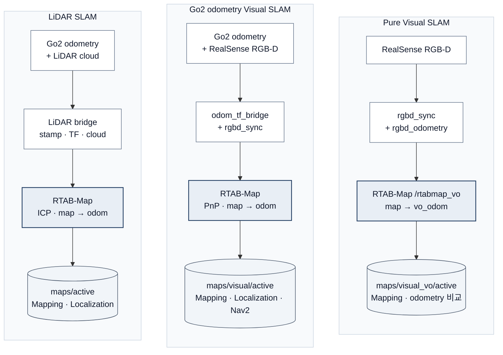

  <h1>Go2 LiDAR & Visual SLAM</h1>
  
  
  
  
  
Unitree Go2에서 LiDAR, Go2 odometry 기반 RGB-D, 순수 RGB-D SLAM을 비교·운용하는 ROS 2 연구 프로젝트

  <a href="#overview">개요</a> ·
  <a href="#architecture">아키텍처</a> ·
  <a href="#slam-modules">SLAM 모듈</a> ·
  <a href="#results">주요 결과</a> ·
  <a href="#quick-start">빠른 시작</a> ·
  <a href="#documentation">문서</a>

---

## 🎯 프로젝트 개요

이 저장소는 Unitree Go2와 RealSense를 RTAB-Map에 연결해 세 가지 SLAM 경로를
실기에서 구현하고 비교한 연구 기록이다.

- Go2 내장 LiDAR와 자체 odometry를 사용하는 **LiDAR SLAM**
- Go2 odometry와 RealSense RGB-D를 결합하는 **Go2 odometry 기반 Visual SLAM**
- Go2 odometry 없이 RGB-D visual odometry를 사용하는 **순수 Visual SLAM**

새로운 SLAM 알고리즘을 제안하기보다 실제 로봇에서 발생하는 시간축, QoS, TF, 센서
동기화와 map database 운용 문제를 해결하고, 각 경로의 동작 범위와 한계를 재현 가능한
코드·설정·실험 기록으로 남기는 데 초점을 둔다. Go2 odometry 기반 Visual 경로는
저장된 RTAB-Map DB를 사용한 localization과 Nav2 연결까지 포함한다.

## 🔬 연구 초점

| 연구 항목 | 이 저장소에서 다루는 문제 |
|---|---|
| 시간축 정규화 | Go2 sensor stamp와 ROS clock 사이 epoch offset을 한 번 계산하고 odom과 cloud에 동일하게 적용 |
| ROS 2 QoS | Go2 raw topic의 실제 publisher QoS에 맞춘 odometry·point cloud 구독 |
| TF 소유권 | 모듈별로 `odom → base_link` 또는 `vo_odom → base_link`를 한 노드만 발행 |
| PointCloud2 변환 | padding record를 제거하면서 field layout을 보존하고 cloud를 `base_link`로 변환 |
| RGB-D 동기화 | color, aligned depth, CameraInfo와 Go2 odometry의 시간 관계를 조정 |
| DB 기반 운용 | mapping DB 분리, 기존 DB localization, reset과 SQLite sidecar 수명주기 관리 |

자세한 설계 결정과 데이터 흐름은
[시스템 아키텍처](docs/ARCHITECTURE.md)에 정리돼 있다.

## 🏛️ 시스템 아키텍처

README에서는 세 SLAM 경로를 나란히 놓고, 각 경로의 데이터 흐름을 위에서 아래로
비교한다. 세부 topic 연결과 노드별 책임은 [시스템 아키텍처](docs/ARCHITECTURE.md)에서
확인할 수 있다.

```mermaid
flowchart LR
    subgraph LIDAR["LiDAR SLAM"]
        direction TB
        L1["Go2 odometry<br/>+ LiDAR cloud"]
        L2["LiDAR bridge<br/>stamp · TF · cloud"]
        L3["RTAB-Map<br/>ICP · map → odom"]
        L4[("maps/active<br/>Mapping · Localization")]
        L1 --> L2 --> L3 --> L4
    end

    subgraph VISUAL["Go2 odometry Visual SLAM"]
        direction TB
        V1["Go2 odometry<br/>+ RealSense RGB-D"]
        V2["odom_tf_bridge<br/>+ rgbd_sync"]
        V3["RTAB-Map<br/>PnP · map → odom"]
        V4[("maps/visual/active<br/>Mapping · Localization · Nav2")]
        V1 --> V2 --> V3 --> V4
    end

    subgraph PURE["Pure Visual SLAM"]
        direction TB
        P1["RealSense RGB-D"]
        P2["rgbd_sync<br/>+ rgbd_odometry"]
        P3["RTAB-Map /rtabmap_vo<br/>map → vo_odom"]
        P4[("maps/visual_vo/active<br/>Mapping · odometry 비교")]
        P1 --> P2 --> P3 --> P4
    end

    LIDAR ~~~ VISUAL
    VISUAL ~~~ PURE

    classDef base fill:#ffffff,stroke:#64748b,color:#0f172a,stroke-width:1px
    classDef slam fill:#e8eef5,stroke:#1e3a5f,color:#0f172a,stroke-width:1.5px
    classDef database fill:#f1f5f9,stroke:#475569,color:#0f172a,stroke-width:1px
    class L1,L2,V1,V2,P1,P2 base
    class L3,V3,P3 slam
    class L4,V4,P4 database

    style LIDAR fill:#f8fafc,stroke:#cbd5e1,color:#0f172a,stroke-width:1px
    style VISUAL fill:#f8fafc,stroke:#cbd5e1,color:#0f172a,stroke-width:1px
    style PURE fill:#f8fafc,stroke:#cbd5e1,color:#0f172a,stroke-width:1px
```

| 모듈 | odometry | RTAB-Map 입력 | 지역 TF | 기본 DB | 현재 지원 범위 |
|---|---|---|---|---|---|
| LiDAR SLAM | Go2 `/utlidar/robot_odom` | `/odom` + `/scan_cloud` | `odom → base_link` | `maps/active/rtabmap.db` | mapping, 알려진 시작 자세 중심 localization |
| Go2 odometry Visual | Go2 `/utlidar/robot_odom` | `/odom` + RGB-D | `odom → base_link` | `maps/visual/active/rtabmap.db` | mapping, localization, Nav2 |
| 순수 Visual | RTAB-Map `rgbd_odometry` | `/odom/vo` + RGB-D + odom info | `vo_odom → base_link` | `maps/visual_vo/active/rtabmap.db` | mapping, Go2 odometry 비교 |

RTAB-Map은 각 경로에서 전역 관계인 `map → odom` 또는 `map → vo_odom`을 제공한다.
세 모듈의 DB와 지역 odometry TF는 서로 공유하지 않는다.

## 🧭 세 SLAM 모듈

### 1. LiDAR SLAM

Go2의 `/utlidar/robot_odom`과 `/utlidar/cloud_deskewed`를 하나의 bridge에서
정규화한다. 같은 epoch offset을 두 입력에 적용하고, cloud를 `base_link`로 변환해
RTAB-Map ICP registration에 전달한다.

~~~bash
ros2 launch go2_rtabmap_launch slam.launch.py \
  database_path:=maps/active/rtabmap.db \
  rviz:=true
~~~

Mapping과 기존 DB localization 경로가 구현돼 있다. 다만 비슷한 구조에서 잘못된 ICP
match가 승인될 수 있어 완전한 kidnapped-robot global relocalization보다 **대략적인
초기 위치를 알고 시작하는 운용**에 적합하다.

### 2. Go2 odometry 기반 Visual SLAM

Go2 odometry를 지역 이동 기준으로 유지하면서 RealSense color와 aligned depth를
RTAB-Map visual registration에 사용한다. 현재 기본 구성은 3D-to-2D PnP, neighbor
refinement, spatial proximity와 8 Hz mapping 처리율을 사용한다.

~~~bash
ros2 launch go2_nav2_bringup visual_mapping_mode.launch.py \
  database_path:=maps/visual/active/rtabmap.db
~~~

이 경로는 mapping, 기존 DB localization과 Nav2까지 연결된다. RTAB-Map이 occupancy
map과 `map → odom`을 제공하고, aligned depth는 Nav2 obstacle source로 변환된다.
카메라 extrinsic은 현재 운용값이며 정밀 calibration을 완료한 값으로 간주하지 않는다.

### 3. 순수 Visual SLAM

Go2 odometry를 사용하지 않는다. `rtabmap_odom/rgbd_odometry`가 `/odom/vo`와
`vo_odom → base_link`를 만들고, 별도 `/rtabmap_vo` namespace의 RTAB-Map이
RGB-D mapping을 수행한다.

~~~bash
ros2 launch go2_rtabmap_launch vo_visual_slam.launch.py \
  database_path:=maps/visual_vo/active/rtabmap.db \
  rviz:=true
~~~

현재 완료 범위는 RGB-D visual odometry 기반 mapping과 Go2 odometry 비교다. 이
모듈만을 위한 localization과 Nav2 launch는 아직 제공하지 않는다.

각 모듈의 전체 인자, 센서 확인 순서와 DB 운용법은
[설치·실행·운영 가이드](docs/OPERATIONS.md)를 따른다.

## 📊 주요 연구 결과

아래 값은 서로 다른 성격의 근거를 요약한 것이다. 자동 테스트, 보존 산출물과 과거 실기
관측은 동일한 검증 수준으로 해석하지 않는다.

| 근거 | 대표 결과 | 해석 범위 |
|---|---|---|
| 자동 검증 기록 | 2026-08-05 기준 **76 passed** | bridge, launch, config와 command safety 계약 |
| Go2 odometry Visual 8 Hz 주행 | 실효 **7.43 Hz**, neighbor refinement **90/95** 성공, global closure **194 inlier** | 한 차례 전체 루프 주행의 처리·graph 기록 |
| 일반 주행 VO 비교 | position 차이 RMSE **0.239 m**, yaw 차이 RMSE **2.218°** | Go2와 VO 사이의 불일치량 |
| 느린 주행 VO 비교 | position 차이 RMSE **0.384 m**, yaw 차이 RMSE **6.442°** | 별도 느린 주행에서 측정한 불일치량 |

Visual 8 Hz 실험에서는 과거의 큰 이중상이 육안으로 재현되지 않았고, 마지막 loop
closure는 314개 match 중 194개 inlier를 사용했다. 이 결과를 근거로 8 Hz, PnP와
neighbor refinement를 현재 기본값으로 채택했다. Spatial proximity를 추가한 별도
통제 기록에서는 긴 loop 불일치가 줄었지만, 주행 경로에 따라 proximity link가 항상
생성되는 것은 아니다.

> [!IMPORTANT]
> Go2 odometry와 Visual Odometry 중 어느 것도 ground truth가 아니다. 위 position·yaw
> 차이는 두 추정기의 **불일치량**이며 어느 쪽의 절대 정확도가 더 높은지 증명하지 않는다.
> 정확도 판정에는 motion capture, survey point 또는 AprilTag 기준 궤적처럼 독립된
> ground truth가 필요하다.

실험 조건, 근거 등급, 전체 DB·bag 통계와 해석 제한은
[검증 결과와 실험 근거](docs/VALIDATION.md)에서 확인할 수 있다.

## 🛠️ 요구 환경

- Ubuntu 22.04 LTS
- ROS 2 Humble
- `rtabmap_ros`
- 같은 DDS 네트워크의 Unitree Go2
- Visual 경로용 RealSense aligned RGB-D
- Unitree message와 RobotModel을 제공하는 `go2_ws` overlay

Go2 raw topic은 ROS daemon cache에 나타나지 않을 수 있으므로 `--no-daemon` 조회를
사용한다.

~~~bash
ros2 topic list --no-daemon
ros2 topic info /utlidar/robot_odom --verbose --no-daemon
ros2 topic info /utlidar/cloud_deskewed --verbose --no-daemon
~~~

## ⚙️ 설치와 빌드

~~~bash
git clone https://github.com/leesj24601/lidar-vs-visual-slam.git go2_lidar_slam
cd go2_lidar_slam

source /opt/ros/humble/setup.bash
rosdep install --from-paths src --ignore-src -r -y
colcon build --symlink-install
source install/setup.bash
~~~

Unitree message와 description이 필요한 build·실행 터미널에서는 overlay를 다음 순서로
source한다.

~~~bash
source /opt/ros/humble/setup.bash
source ~/go2_ws/install/setup.bash
source ~/go2_lidar_slam/install/setup.bash
~~~

이 프로젝트는 `go2_ws`의 설치된 message와 description을 사용한다. 별도 통합
`go2_driver` 또는 `go2_bringup` launch를 동시에 실행해 sensor·TF publisher를
중복시키지 않는다.

## 🚀 빠른 시작

모든 명령은 저장소 루트에서 실행한다.

**LiDAR mapping**

~~~bash
ros2 launch go2_rtabmap_launch slam.launch.py \
  database_path:=maps/active/rtabmap.db \
  rviz:=true
~~~

**Go2 odometry 기반 Visual mapping**

~~~bash
ros2 launch go2_nav2_bringup visual_mapping_mode.launch.py \
  database_path:=maps/visual/active/rtabmap.db
~~~

**순수 Visual mapping**

~~~bash
ros2 launch go2_rtabmap_launch vo_visual_slam.launch.py \
  database_path:=maps/visual_vo/active/rtabmap.db \
  rviz:=true
~~~

**Visual localization + Nav2 안전 점검**

~~~bash
ros2 launch go2_nav2_bringup visual_navigation_mode.launch.py \
  database_path:=maps/visual/active/rtabmap.db \
  enable_motion:=false \
  rviz:=true \
  show_robot_model:=true \
  lowstate_topic:=/lowstate
~~~

먼저 `enable_motion:=false`로 localization, TF, costmap, path와 RobotModel을 확인한다.
주변을 비우고 운용자와 비상 정지 수단을 준비한 실기 시험에서만
`enable_motion:=true`를 명시한다.

## ✅ 검증·안전·알려진 한계

> [!WARNING]
> 이 저장소의 자동 테스트는 코드·launch·config 계약을 검증한다. 실제 지도 정확도,
> 모든 출발 위치의 localization 성공 또는 안전한 자율주행을 보장하지 않는다.

- Mapping의 `reset_db` 기본값은 `false`다. `reset_db:=true`는 선택한 DB와 같은
  이름의 SQLite sidecar를 제거하므로 새 실험에서만 사용한다.
- LiDAR, Go2 odometry Visual, Pure Visual DB를 서로 바꿔 쓰지 않는다.
- 여러 모듈을 동시에 실행해 같은 TF child frame을 중복 발행하지 않는다.
- Localization에는 존재하는 DB를 명시하고, 비교 실험은 active DB가 아닌 별도 경로에서
  시작한다.
- LiDAR localization은 알려진 시작 자세에 가깝게 운용하며 scan과 저장 map의 실제
  정합을 함께 확인한다.
- Visual 경로는 카메라 calibration, exposure, motion blur와 extrinsic 오차의 영향을
  받는다.
- Pure Visual 경로에는 전용 localization·Nav2 launch가 없다.
- 실제 모션은 `enable_motion:=false` 검증을 통과한 뒤에만 허용한다.

현재 자동 테스트 명령은 다음과 같다.

~~~bash
python3 -m pytest -q \
  src/go2_rtabmap_bridge/test \
  src/go2_rtabmap_launch/test \
  src/go2_nav2_bringup/test \
  src/go2_nav2_control/test
~~~

## 📂 저장소 구조

~~~text
go2_lidar_slam/
├── README.ko.md
├── dashboard/                     # LiDAR mapping/localization 보조 Web UI
├── docs/
│   ├── ARCHITECTURE.md            # 데이터 흐름, TF와 설계 결정
│   ├── OPERATIONS.md              # 설치, 실행과 DB·bag 운용
│   ├── GO2_REFERENCE.md           # Go2 topic, QoS, TF와 센서 특성
│   ├── VALIDATION.md              # 테스트·DB·bag·실험 근거
│   ├── TROUBLESHOOTING.md         # 증상별 원인과 확인 명령
│   ├── adr/                       # Architecture Decision Records
│   └── superpowers/               # 과거 설계와 구현 계획
├── maps/                          # 모듈별 RTAB-Map DB
├── bags/                          # odometry 비교 rosbag
├── results/                       # 비교 분석 JSON·CSV
└── src/
    ├── go2_rtabmap_bridge/        # timestamp, odom, TF, cloud bridge
    ├── go2_rtabmap_launch/        # RTAB-Map launch와 config
    ├── go2_nav2_bringup/          # Visual mapping/navigation 상위 mode
    └── go2_nav2_control/          # Sport command와 LowState joint bridge
~~~

## 📚 문서

| 문서 | 역할 |
|---|---|
| [README.ko.md](README.ko.md) | 프로젝트 소개, 핵심 결과와 최소 실행 예시 |
| [ARCHITECTURE](docs/ARCHITECTURE.md) | 세 SLAM 모듈의 데이터 흐름, TF, package 책임과 설계 결정 |
| [OPERATIONS](docs/OPERATIONS.md) | 설치, mapping/localization/Nav2, DB와 bag 운용 |
| [GO2_REFERENCE](docs/GO2_REFERENCE.md) | Go2 raw topic, QoS, TF와 센서 특성 |
| [VALIDATION](docs/VALIDATION.md) | 자동 테스트, 보존 산출물, 실험 수치와 해석 범위 |
| [TROUBLESHOOTING](docs/TROUBLESHOOTING.md) | 증상별 원인, 조치와 확인 명령 |
| [ADR 001](docs/adr/001-slam-tool-selection.md) | SLAM 도구 선정 배경 |

`docs/superpowers/`는 당시의 설계와 구현 계획을 보존한 연구 기록이다. 현재 동작은 실제
코드와 위 핵심 문서를 기준으로 판단한다.

## 🗺️ 연구 상태

| 모듈 | 확인된 완료 범위 | 남은 핵심 검증 |
|---|---|---|
| LiDAR SLAM | bridge 계약, mapping DB, 알려진 시작 자세 localization 경로 | 반복 localization 성공률, 전역 초기화, 정량 지도 오차 |
| Go2 odometry Visual | RGB-D mapping·localization, 8 Hz/PnP/proximity 설정, Nav2 경로 | camera extrinsic 재측정, 속도별 blur, 반복 loop·Nav2 주행 |
| 순수 Visual | RGB-D VO mapping, DB, Go2 odometry 비교 bag·분석 | 독립 ground truth, 전용 localization, Nav2 통합 |

현 시점에는 LiDAR를 카메라 조건과 무관한 기준 mapping 경로로, Go2 odometry Visual을
RGB-D loop constraint와 Nav2를 포함한 주 경로로 사용한다. Pure Visual은 Go2
odometry 의존성을 제거한 실험·비교 경로로 유지한다.

## 🤝 관련 기술

- [ROS 2](https://docs.ros.org/en/humble/) — robot middleware
- [RTAB-Map](https://github.com/introlab/rtabmap) /
  [rtabmap_ros](https://github.com/introlab/rtabmap_ros) — graph-based SLAM과 ROS 2 integration
- [Nav2](https://navigation.ros.org/) — localization 결과를 사용하는 navigation stack
- [Unitree Robotics](https://github.com/unitreerobotics) — Go2 platform과 SDK

## 📄 License

`go2_rtabmap_bridge`, `go2_rtabmap_launch`, `go2_nav2_bringup`,
`go2_nav2_control`의 ROS package manifest는 MIT license를 선언한다. 현재 저장소
루트에는 별도 `LICENSE` 파일이 없으므로 저장소 전체 배포 조건은 재사용 전에 확인해야
한다.
