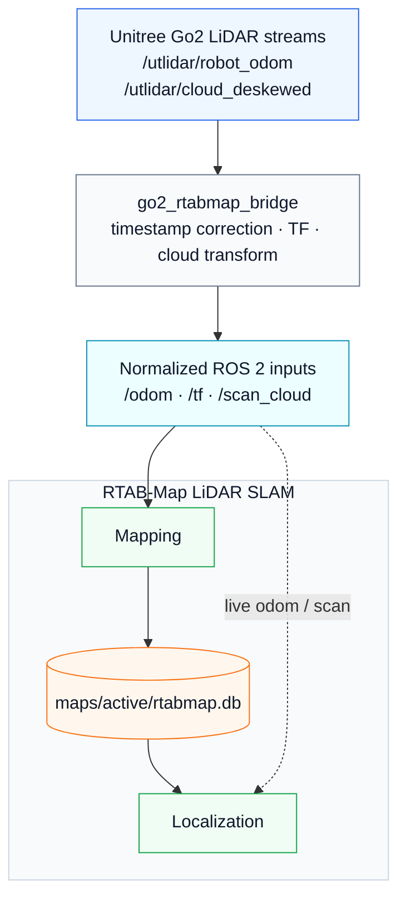

<div align="center">
  <h1>Go2 LiDAR SLAM</h1>
  
  
  
  
  
  
  <p>ROS 2 and RTAB-Map based LiDAR SLAM pipeline for the Unitree Go2.</p>
</div>

<p align="center">
  <a href="README.ko.md">
    
  </a>
</p>

---

## Overview

**Go2 LiDAR SLAM** is a real-hardware ROS 2 pipeline that connects the Unitree Go2's built-in LiDAR odometry and deskewed point cloud streams to **RTAB-Map** for indoor 3D LiDAR mapping and map-based localization.

The project focuses on the difficult integration layer between Go2 bare DDS topics and standard ROS 2 SLAM tools: timestamp correction, QoS compatibility, TF publication, PointCloud2 frame conversion, RTAB-Map launch configuration, map database management, and repeatable diagnostics. It is also structured so that a future **Visual SLAM** track can be added and compared against the current LiDAR SLAM baseline.

---

## Table of Contents

- [Overview](#overview)
- [System Architecture](#system-architecture)
- [Project Roadmap](#project-roadmap)
- [Prerequisites](#prerequisites)
- [Installation & Setup](#installation--setup)
- [Project Structure](#project-structure)
- [Modules](#modules)
  - [1. Go2 RTAB-Map Bridge](#1-go2-rtab-map-bridge)
  - [2. LiDAR Mapping](#2-lidar-mapping)
  - [3. Map-Based Localization](#3-map-based-localization)
  - [4. Control Dashboard](#4-control-dashboard)
  - [5. Diagnostics & Testing](#5-diagnostics--testing)
- [Reference Documents](#reference-documents)
- [Acknowledgements](#acknowledgements)
- [License](#license)

---

## System Architecture

The stack turns Go2-specific sensor streams into RTAB-Map-compatible ROS 2 inputs. The bridge keeps the relative timing between odometry and point clouds, publishes the missing `odom -> base_link` TF, and converts the deskewed cloud into the `base_link` frame before RTAB-Map consumes it.



---

## Project Roadmap

- [x] **Phase 1: Project scaffold and Go2 reference capture**
  - ROS 2 package layout, Go2 topic reference, and SLAM design notes.
- [x] **Phase 2: Go2 RTAB-Map bridge**
  - `/utlidar/robot_odom` to `/odom` republishing.
  - `odom -> base_link` TF publication.
  - `/utlidar/cloud_deskewed` to `/scan_cloud` conversion.
- [x] **Phase 3: RTAB-Map LiDAR mapping**
  - Indoor LiDAR-only RTAB-Map configuration.
  - Database creation under `maps/active/rtabmap.db`.
- [x] **Phase 4: Map-based localization**
  - Existing RTAB-Map DB loading.
  - Optional initial pose support.
- [x] **Phase 5: Real Go2 verification**
  - Bridge, mapping, map topic publication, and localization pose output verified on physical Go2 hardware.
- [x] **Phase 6: Web dashboard prototype**
  - Browser-based mapping/localization control surface with a Python backend.
- [ ] **Phase 7: Known-start localization stabilization**
  - `ALIGN -> LOCK -> TRACKING` workflow for stable known-start localization.
- [ ] **Phase 8: Global relocalization PoC**
  - Scan Context + ICP candidate validation for more robust relocalization.
- [ ] **Phase 9: Visual SLAM comparison track**
  - Add a Visual SLAM baseline and compare LiDAR SLAM vs Visual SLAM on the same Go2 platform.

---

## Prerequisites

- **OS**: Ubuntu 22.04 LTS
- **ROS 2**: Humble Hawksbill
- **SLAM**: `rtabmap_ros` / `rtabmap_slam`
- **Robot**: Unitree Go2 connected to the same DDS network
- **Python**: Python 3
- **Optional movement control**: a separate Go2 ROS 2 workspace such as `/home/cvr/Desktop/sj/go2_ws`

Go2 DDS topics may not appear in the ROS daemon cache. Prefer `--no-daemon` when checking raw Go2 topics.

```bash
ros2 topic list --no-daemon
ros2 topic info /utlidar/robot_odom --verbose --no-daemon
ros2 topic info /utlidar/cloud_deskewed --verbose --no-daemon
```

---

## Installation & Setup

1. **Clone the repository**:

   ```bash
   git clone https://github.com/leesj24601/go2_lidar_slam.git
   cd go2_lidar_slam
   ```

2. **Source ROS 2**:

   ```bash
   source /opt/ros/humble/setup.bash
   ```

3. **Install ROS dependencies**:

   ```bash
   sudo apt update
   sudo apt install ros-humble-rtabmap-ros
   rosdep install --from-paths src --ignore-src -r -y
   ```

4. **Build the workspace**:

   ```bash
   colcon build --symlink-install
   source install/setup.bash
   ```

5. **Optional: source the Go2 movement-control workspace**:

   Source this only when you need Go2 motion control in addition to SLAM.

   ```bash
   source /home/cvr/Desktop/sj/go2_ws/install/setup.bash
   ```

---

## Project Structure

```text
go2_lidar_slam/
├── COMMANDS.md                         # Short command notes
├── SLAM_PLAN.md                        # Detailed implementation plan
├── STATUS.md                           # Current project status and verification notes
├── dashboard/                          # Static Web UI and Python control backend
├── docs/
│   ├── GO2_REFERENCE.md                # Go2 topic, TF, QoS, and timestamp reference
│   ├── RUNBOOK.md                      # Build, mapping, localization, and diagnosis workflow
│   ├── TROUBLESHOOTING.md              # Integration issues and fixes
│   └── adr/
│       └── 001-slam-tool-selection.md  # Architecture decision record
├── maps/
│   ├── active/                         # Active RTAB-Map DB location
│   ├── backups/                        # Backed-up active DBs
│   └── sessions/                       # Session-specific RTAB-Map DBs
└── src/
    ├── go2_rtabmap_bridge/             # Go2 sensor bridge package
    └── go2_rtabmap_launch/             # RTAB-Map launch/config package
```

---

> [!IMPORTANT]
> **Execution Rule**: Run the commands below from the project root directory unless another directory is explicitly shown.

## Modules

### 1. Go2 RTAB-Map Bridge

The bridge node converts Go2-specific LiDAR streams into RTAB-Map inputs:

| Input | Output | Purpose |
|------|--------|---------|
| `/utlidar/robot_odom` | `/odom` | Correct timestamp and republish odometry |
| `/utlidar/robot_odom` | `/tf` | Publish `odom -> base_link` |
| `/utlidar/cloud_deskewed` | `/scan_cloud` | Correct timestamp and transform cloud into `base_link` |

Run the bridge by itself:

```bash
source /opt/ros/humble/setup.bash
source install/setup.bash
ros2 run go2_rtabmap_bridge bridge_node
```

Verify bridge output in another terminal:

```bash
source /opt/ros/humble/setup.bash
source install/setup.bash

ros2 topic hz /odom
ros2 topic hz /scan_cloud
ros2 run tf2_ros tf2_echo odom base_link
```

Expected real-hardware rates:

- `/odom`: about 150 Hz
- `/scan_cloud`: about 14.7 Hz
- `tf2_echo odom base_link`: continuous transform output

### 2. LiDAR Mapping

Start RTAB-Map mapping with the default active database path:

```bash
source /opt/ros/humble/setup.bash
source install/setup.bash

ros2 launch go2_rtabmap_launch slam.launch.py
```

Use an explicit database path:

```bash
ros2 launch go2_rtabmap_launch slam.launch.py \
  database_path:=/home/cvr/Desktop/sj/go2_lidar_slam/maps/active/rtabmap.db
```

Start a fresh map by deleting the selected DB and SQLite sidecar files:

```bash
ros2 launch go2_rtabmap_launch slam.launch.py reset_db:=true
```

Enable visualization when needed:

```bash
ros2 launch go2_rtabmap_launch slam.launch.py rviz:=true
ros2 launch go2_rtabmap_launch slam.launch.py rtabmap_viz:=true
ros2 launch go2_rtabmap_launch slam.launch.py rviz:=true rtabmap_viz:=true
```

Mapping outputs:

| Output | Purpose |
|--------|---------|
| `maps/active/rtabmap.db` | Saved RTAB-Map database |
| `/rtabmap/mapData` | RTAB-Map update data |
| `/rtabmap/cloud_map` | Accumulated 3D cloud map |
| `/rtabmap/map` | 2D occupancy grid output |
| `/rtabmap/mapGraph` | Pose graph |
| `/rtabmap/info` | Statistics and loop-closure information |

### 3. Map-Based Localization

Localization reuses an existing RTAB-Map database:

```bash
source /opt/ros/humble/setup.bash
source install/setup.bash

ros2 launch go2_rtabmap_launch localization.launch.py \
  database_path:=/home/cvr/Desktop/sj/go2_lidar_slam/maps/active/rtabmap.db
```

If the robot starts far from the original mapping start pose, provide an initial pose:

```bash
ros2 launch go2_rtabmap_launch localization.launch.py \
  database_path:=/home/cvr/Desktop/sj/go2_lidar_slam/maps/active/rtabmap.db \
  initial_pose:="0 0 0 0 0 0"
```

Verify localization:

```bash
ros2 topic hz /rtabmap/localization_pose
ros2 topic echo /rtabmap/localization_pose --once
ros2 node info /rtabmap/rtabmap
```

Current limitation: the LiDAR-only RTAB-Map configuration behaves best as a known-start localization baseline. Fully robust kidnapped/global relocalization is planned as a separate Scan Context + ICP PoC.

### 4. Control Dashboard

The dashboard provides a browser UI for mapping and localization control.

<p>
  <a href="https://leesj24601.github.io/lidar-vs-visual-slam/dashboard/">
    
  </a>
</p>

Run the backend after sourcing ROS 2 and this workspace:

```bash
source /opt/ros/humble/setup.bash
source install/setup.bash
python3 dashboard/server.py --host 127.0.0.1 --port 8080
```

Open:

```text
http://127.0.0.1:8080
```

For static preview without ROS:

```bash
cd dashboard
python3 -m http.server 8080
```

See [`dashboard/README.md`](dashboard/README.md) for API details.

### 5. Diagnostics & Testing

Build and test:

```bash
source /opt/ros/humble/setup.bash
colcon build --symlink-install
colcon test --event-handlers console_direct+
```

Check launch arguments:

```bash
ros2 launch go2_rtabmap_launch slam.launch.py --show-args
ros2 launch go2_rtabmap_launch localization.launch.py --show-args
```

Basic diagnosis order:

```bash
ros2 topic hz /utlidar/robot_odom --no-daemon
ros2 topic hz /utlidar/cloud_deskewed --no-daemon
ros2 topic hz /odom
ros2 topic hz /scan_cloud
ros2 run tf2_ros tf2_echo odom base_link
ros2 topic hz /rtabmap/mapData
```

---

## Reference Documents

- [`SLAM_PLAN.md`](SLAM_PLAN.md): implementation plan and architecture details
- [`STATUS.md`](STATUS.md): current progress, completed work, limitations, and verification notes
- [`docs/RUNBOOK.md`](docs/RUNBOOK.md): repeatable build, mapping, localization, and troubleshooting workflow
- [`docs/GO2_REFERENCE.md`](docs/GO2_REFERENCE.md): measured Go2 topics, QoS, TF, and timestamp behavior
- [`docs/TROUBLESHOOTING.md`](docs/TROUBLESHOOTING.md): symptoms, root causes, fixes, and verification commands
- [`docs/adr/001-slam-tool-selection.md`](docs/adr/001-slam-tool-selection.md): SLAM tool and bridge architecture decision

---

## Acknowledgements

- [ROS 2 Humble](https://docs.ros.org/en/humble/)
- [RTAB-Map ROS](https://github.com/introlab/rtabmap_ros)
- [Unitree Go2](https://www.unitree.com/go2)

---

## License

This project currently uses the MIT license in its ROS package manifests.
