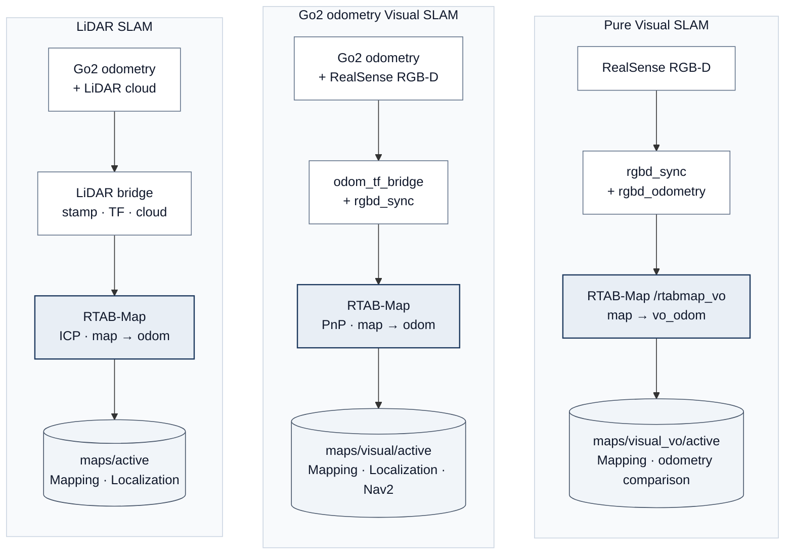

  <h1>Go2 LiDAR & Visual SLAM</h1>
  
  
  
  
  
A ROS 2 research project for comparing and operating LiDAR, Go2 odometry-based RGB-D, and pure RGB-D SLAM on a Unitree Go2

  

  <a href="#overview">Overview</a> ·
  <a href="#architecture">Architecture</a> ·
  <a href="#results">Key Results</a> ·
  <a href="#quick-start">Quick Start</a> ·
  <a href="#documentation">Documentation</a>

---

## 🎯 Project Overview

This repository documents the implementation and comparison of three SLAM pipelines on a
physical Unitree Go2 by integrating the robot and a RealSense camera with RTAB-Map.

- **LiDAR SLAM** using the Go2's built-in LiDAR and onboard odometry
- **Go2 odometry-based Visual SLAM** combining Go2 odometry with RealSense RGB-D
- **Pure Visual SLAM** using RGB-D visual odometry without Go2 odometry

Rather than proposing a new SLAM algorithm, this project addresses sensor timeline mismatches,
TF publication conflicts, and RGB-D/odometry visual alignment issues that arise on a physical
robot. It validates and tunes the configurations and key parameters of all three SLAM pipelines
against real-world results. The operating scope and limitations of each pipeline are documented
through reproducible code, configuration, and experiment records. The Go2 odometry-based Visual
pipeline also includes localization from a saved RTAB-Map database and Nav2 integration.

## 🔬 Research Focus

| Research area | Problem addressed in this repository |
|---|---|
| Sensor timeline alignment | Calculate the epoch offset between Go2 sensor stamps and the ROS clock while preserving the relative timing between odometry and the LiDAR cloud |
| TF tree and coordinate-frame integration | Build `map → odom → base_link` chains for LiDAR and Go2 odometry-based Visual pipelines and a `map → vo_odom → base_link` chain for Pure Visual, while separating global and local TF publishers to connect sensors and Nav2 within consistent coordinate frames |
| Parameter validation across three SLAM pipelines | Validate and tune the registration, synchronization, and processing-rate settings of LiDAR SLAM, Go2 odometry-based Visual SLAM, and Pure Visual SLAM based on real-world results |
| RGB-D and odometry visual alignment | Approximately synchronize color, aligned depth, and CameraInfo, then compensate for the measured residual timing error in Go2 odometry |
| 3D mapping, localization, and navigation validation | Generate 3D maps with all three SLAM pipelines, validate saved-map localization with the LiDAR and Go2 odometry-based Visual pipelines, and validate Nav2 goal navigation with the Go2 odometry-based Visual pipeline on the physical robot |

Detailed design decisions and data flows are documented in the
[system architecture](docs/ARCHITECTURE.md).

## 🏛️ System Architecture

This README places the three SLAM pipelines side by side and compares their data flows from top
to bottom. Detailed topic connections and node responsibilities are available in the
[system architecture](docs/ARCHITECTURE.md).

```mermaid
flowchart LR
    subgraph LIDAR["LiDAR SLAM"]
        direction TB
        L1["Go2 odometry<br/>+ LiDAR cloud"]
        L2["LiDAR bridge<br/>stamp · TF · cloud"]
        L3["RTAB-Map<br/>ICP · map → odom"]
        L4[("maps/active<br/>Mapping · Localization")]
        L1 --> L2 --> L3 --> L4
    end

    subgraph VISUAL["Go2 odometry Visual SLAM"]
        direction TB
        V1["Go2 odometry<br/>+ RealSense RGB-D"]
        V2["odom_tf_bridge<br/>+ rgbd_sync"]
        V3["RTAB-Map<br/>PnP · map → odom"]
        V4[("maps/visual/active<br/>Mapping · Localization · Nav2")]
        V1 --> V2 --> V3 --> V4
    end

    subgraph PURE["Pure Visual SLAM"]
        direction TB
        P1["RealSense RGB-D"]
        P2["rgbd_sync<br/>+ rgbd_odometry"]
        P3["RTAB-Map /rtabmap_vo<br/>map → vo_odom"]
        P4[("maps/visual_vo/active<br/>Mapping · odometry comparison")]
        P1 --> P2 --> P3 --> P4
    end

    LIDAR ~~~ VISUAL
    VISUAL ~~~ PURE

    classDef base fill:#ffffff,stroke:#64748b,color:#0f172a,stroke-width:1px
    classDef slam fill:#e8eef5,stroke:#1e3a5f,color:#0f172a,stroke-width:1.5px
    classDef database fill:#f1f5f9,stroke:#475569,color:#0f172a,stroke-width:1px
    class L1,L2,V1,V2,P1,P2 base
    class L3,V3,P3 slam
    class L4,V4,P4 database

    style LIDAR fill:#f8fafc,stroke:#cbd5e1,color:#0f172a,stroke-width:1px
    style VISUAL fill:#f8fafc,stroke:#cbd5e1,color:#0f172a,stroke-width:1px
    style PURE fill:#f8fafc,stroke:#cbd5e1,color:#0f172a,stroke-width:1px
```

**Inputs and coordinate frames**

| Module | Odometry | RTAB-Map input | Local TF |
|---|---|---|---|
| LiDAR SLAM | Go2 `/utlidar/robot_odom` | `/odom` + `/scan_cloud` | `odom → base_link` |
| Go2 odometry Visual | Go2 `/utlidar/robot_odom` | `/odom` + RGB-D | `odom → base_link` |
| Pure Visual | RTAB-Map `rgbd_odometry` | `/odom/vo` + RGB-D + odom info | `vo_odom → base_link` |

RTAB-Map provides the global `map → odom` or `map → vo_odom` relationship for each pipeline.
The three modules do not share databases or local odometry TFs.

## 📊 Key Research Results

The values below summarize statistics extracted from retained artifacts and observations from
earlier physical-robot experiments. Because the experimental conditions and evaluation targets
differ, these values should not be interpreted as a performance comparison under a common metric.

| Experiment | Representative result | Scope of interpretation |
|---|---|---|
| RGB-D and Go2 odometry visual alignment | Maximum rotational-signal correlation of **0.9926**; adopted residual timing correction of **-15 ms** | Measured with the current camera and Go2 combination |
| Visual 8 Hz and PnP run | Effective rate of **7.43 Hz**, neighbor refinement succeeded **90/95** times, and the global closure used **194 inliers** | Processing and graph record from a single full-loop run |
| Spatial proximity controlled experiment | Median long-loop positional inconsistency decreased from **0.80 to 0.26 m**, and rotational inconsistency from **8.77 to 3.47°** | Reduction in graph-internal inconsistency, not absolute accuracy |
| Integrated physical operation | Confirmed 3D mapping with all three pipelines, localization with LiDAR and Go2 odometry Visual, and Nav2 goal navigation with Go2 odometry Visual | Functional completion scope; not a repeated success rate or quantitative accuracy result |

### 🎥 Physical-Robot Demo Videos

  <table>
    <tr>
      <td align="center" width="50%">
        
         
        <b>LiDAR SLAM</b>
         
        
      </td>
      <td align="center" width="50%">
        
         
        <b>Go2 odometry-based Visual SLAM</b>
         
        
      </td>
    </tr>
    <tr>
      <td align="center" width="50%">
        
         
        <b>Visual odometry · onboard Go2 odometry comparison</b>
         
        
      </td>
      <td align="center" width="50%">
        
         
        <b>Pure Visual SLAM · Go2 odometry-based Visual SLAM comparison</b>
         
        
      </td>
    </tr>
    <tr>
      <td align="center" colspan="2">
        
         
        <b>Nav2 goal navigation</b>
         
        
      </td>
    </tr>
  </table>

See [validation results and experimental evidence](docs/VALIDATION.md) for detailed experimental
conditions and interpretation limits.

## 🛠️ Requirements

- Ubuntu 22.04 LTS
- ROS 2 Humble
- `rtabmap_ros`
- A Unitree Go2 on the same DDS network
- RealSense aligned RGB-D for the Visual pipelines
- A `go2_ws` overlay providing `unitree_go`, `unitree_api`, and `go2_description`

Go2 raw topics may not appear in the ROS daemon cache, so query them with `--no-daemon`.

~~~bash
ros2 topic list --no-daemon
ros2 topic info /utlidar/robot_odom --verbose --no-daemon
ros2 topic info /utlidar/cloud_deskewed --verbose --no-daemon
~~~

## ⚙️ Installation and Build

### Prepare Go2 Dependencies

This project uses `unitree_go`, `unitree_api`, and `go2_description` from
[Unitree-Go2-Robot/go2_robot](https://github.com/Unitree-Go2-Robot/go2_robot).

~~~bash
sudo apt update
sudo apt install -y python3-vcstool

mkdir -p ~/go2_ws/src
cd ~/go2_ws/src
git clone -b humble https://github.com/Unitree-Go2-Robot/go2_robot.git
vcs import . < go2_robot/dependencies.repos

cd ~/go2_ws
source /opt/ros/humble/setup.bash
rosdep install --from-paths src --ignore-src -r -y
colcon build --symlink-install
~~~

### Build This Repository

~~~bash
cd ~
git clone https://github.com/leesj24601/lidar-vs-visual-slam.git go2_lidar_slam
cd go2_lidar_slam

source /opt/ros/humble/setup.bash
source ~/go2_ws/install/setup.bash
rosdep install --from-paths src --ignore-src -r -y
colcon build --symlink-install
source install/setup.bash
~~~

Source the overlays in the following order in every build and runtime terminal.

~~~bash
source /opt/ros/humble/setup.bash
source ~/go2_ws/install/setup.bash
source ~/go2_lidar_slam/install/setup.bash
~~~

Do not simultaneously run a separate integrated `go2_driver` or `go2_bringup` launch, which
would duplicate sensor and TF publishers.

## 🚀 Quick Start

Run all commands from the repository root.

> [!WARNING]
> The `reset_db:=true` option in the three mapping commands below deletes the selected existing
> database and creates a new map. Back up any database you need to preserve before running them.
> The `enable_motion:=true` option in the Visual localization + Nav2 command enables physical
> robot motion. First use `false` to verify localization, TF, costmaps, paths, and the RobotModel.
> Enable motion only in a physical test with a clear surrounding area, an operator present, and
> an emergency-stop method ready.

**LiDAR mapping**

~~~bash
ros2 launch go2_rtabmap_launch slam.launch.py \
  database_path:=maps/active/rtabmap.db \
  reset_db:=true \
  rviz:=true \
  rtabmap_viz:=true
~~~

**Go2 odometry-based Visual mapping**

~~~bash
ros2 launch go2_nav2_bringup visual_mapping_mode.launch.py \
  database_path:=maps/visual/active/rtabmap.db \
  reset_db:=true \
  rtabmap_viz:=true
~~~

**Pure Visual mapping**

~~~bash
ros2 launch go2_rtabmap_launch vo_visual_slam.launch.py \
  database_path:=maps/visual_vo/active/rtabmap.db \
  reset_db:=true \
  rviz:=true \
  rtabmap_viz:=true
~~~

**Visual localization + Nav2**

~~~bash
ros2 launch go2_nav2_bringup visual_navigation_mode.launch.py \
  database_path:=maps/visual/active/rtabmap.db \
  enable_motion:=true \
  rviz:=true \
  rtabmap_viz:=true
~~~

## ⚠️ Cautions and Limitations

- The three SLAM pipelines do not share databases or local odometry TFs. Run only one pipeline at
  a time, and do not interchange databases between pipelines.
- LiDAR localization is intended for operation from a roughly known starting pose and does not
  guarantee complete global relocalization.
- Visual SLAM is affected by camera FPS, resolution, exposure, motion blur, depth quality, and
  extrinsic calibration.
- Pure Visual SLAM currently supports 3D mapping and comparison with Go2 odometry. Localization
  from a saved map and Nav2 goal navigation are not implemented for this pipeline.

## 📚 Technical Documentation

| Document | Purpose |
|---|---|
| [System architecture](docs/ARCHITECTURE.md) | Data flows, TF conventions, and design decisions for the three SLAM pipelines |
| [Validation results and experimental evidence](docs/VALIDATION.md) | Retained artifacts, experimental measurements, and interpretation limits |

## 🤝 Related Technologies

- [ROS 2](https://docs.ros.org/en/humble/) — robot middleware
- [RTAB-Map](https://github.com/introlab/rtabmap) /
  [rtabmap_ros](https://github.com/introlab/rtabmap_ros) — graph-based SLAM and ROS 2 integration
- [Nav2](https://docs.nav2.org/) — navigation stack using localization results
- [Unitree Robotics](https://github.com/unitreerobotics) — Go2 platform and SDK

## 📄 License

The ROS package manifests for `go2_rtabmap_bridge`, `go2_rtabmap_launch`,
`go2_nav2_bringup`, and `go2_nav2_control`, as well as the repository-wide distribution terms,
are covered by the [MIT License](LICENSE).
