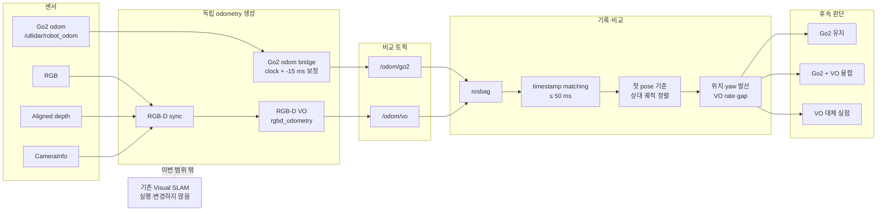
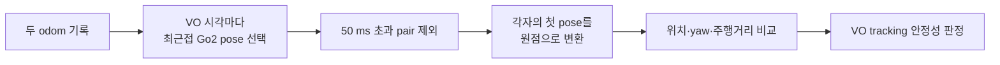
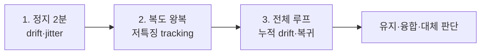
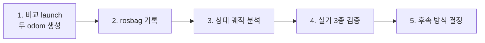

# VO-Go2 Odometry 비교 설계

## 1. 목표

기존 Visual SLAM은 건드리지 않고 RealSense RGB-D 기반 VO를 별도로 생성해 Go2 내부 odometry와 같은 주행에서 비교한다.

확인할 것은 두 가지다.

1. VO가 실제 주행 중 끊기지 않고 동작하는가?
2. VO와 Go2 odometry의 상대 궤적이 언제, 얼마나 달라지는가?

> Go2 odometry도 ground truth가 아니다. 결과는 정확도 오차가 아니라 두 추정기의 차이·발산량으로 해석한다.

### 이번 범위

| 포함 | 제외 |
|---|---|
| `/odom/go2`, `/odom/vo` 독립 생성 | RTAB-Map SLAM과 지도 생성 |
| rosbag 동시 기록 | loop closure와 graph optimization |
| 시간 동기화와 시작 pose 정렬 | 실시간 sensor fusion |
| 위치·yaw·출력 안정성 비교 | Nav2 odometry 전환 |
| 정지·복도·전체 루프 실험 | VO가 더 정확하다는 단정 |

## 2. 한눈에 보는 전체 흐름



## 3. 실행 설계

별도 `vo_odom_comparison.launch.py`에서 다음 노드만 실행한다.

| 구성 요소 | 입력 | 출력 | 역할 |
|---|---|---|---|
| Go2 odom bridge | `/utlidar/robot_odom` | `/odom/go2` | Go2 timestamp를 ROS/카메라 시간축에 맞춤 |
| RGB-D sync | RGB, depth, CameraInfo | 비교용 RGB-D | 세 카메라 입력 동기화 |
| RGB-D VO | 비교용 RGB-D | `/odom/vo` | RGB-D 특징점과 depth로 이동 추정 |
| Camera static TF | 설정된 extrinsic | `base_link → camera_link` | VO 결과를 로봇 body 기준으로 표현 |

`rtabmap_slam`, `rtabmap_viz`, map database는 실행하지 않는다.

### 토픽과 frame

| 구분 | 토픽 | `header.frame_id` | `child_frame_id` |
|---|---|---|---|
| Go2 | `/odom/go2` | `go2_odom` | `base_link` |
| VO | `/odom/vo` | `vo_odom` | `base_link` |

### TF 충돌 방지

```text
Go2 비교 odom     publish_tf = false
RGB-D VO          publish_tf = false
Camera extrinsic  base_link → camera_link만 발행
```

두 odometry는 토픽으로만 비교한다. 동일한 `base_link`에 두 odometry TF가 연결되지 않게 하며, 비교 중에는 기존 Visual SLAM launch도 함께 실행하지 않는다.

## 4. 비교 설계



### 4.1 시간축

Go2 stamp는 기존 bridge와 같은 방식으로 보정한다.

```text
보정된 Go2 stamp
  = sensor stamp
  + 최초 clock epoch offset
  - 0.015 s
```

VO는 RGB-D 카메라 stamp를 사용한다. VO 샘플마다 가장 가까운 Go2 pose를 찾고 `|t_vo - t_go2| ≤ 50 ms`인 쌍만 비교한다.

### 4.2 원점 정렬

두 odometry의 절대 좌표 원점이 다르므로 첫 유효 pose를 각각 제거한다.

```text
Go2 relative(t) = inverse(Go2(0)) × Go2(t)
VO relative(t)  = inverse(VO(0))  × VO(t)
```

회전을 포함한 rigid transform으로 정렬하며 단순 position 빼기는 사용하지 않는다.

### 4.3 비교 순서와 지표

| 우선순위 | 확인 항목 | 핵심 지표 |
|---:|---|---|
| 1 | VO가 계속 동작하는가? | effective rate, max gap, 0.5초 초과 gap 횟수 |
| 2 | 두 토픽 시간이 맞는가? | matched pairs, time gap median/p95/max |
| 3 | 상대 궤적이 얼마나 달라지는가? | path length, position/yaw difference RMSE·p95 |
| 4 | 주행 끝에서 얼마나 벌어지는가? | final position/yaw difference |

기준:

- `VO max gap > 0.5 s`: tracking loss 또는 처리 중단 후보
- `time gap p95 ≤ 33 ms`: 30 Hz 카메라 한 프레임 이내 동기
- position/yaw difference: 정확도 오차가 아닌 두 추정기의 발산량

## 5. 기록과 결과

### 빠른 비교용 bag

```text
/odom/go2
/odom/vo
```

### VO 재처리까지 가능한 bag

```text
/utlidar/robot_odom
/odom/go2
/odom/vo
/camera/color/image_raw
/camera/aligned_depth_to_color/image_raw
/camera/color/camera_info
/tf
/tf_static
```

### 분석 결과

```text
results/
├── <experiment>_samples.csv    # timestamp별 상대 pose와 차이
└── <experiment>_summary.json   # rate, gap, 동기, 발산 요약
```

## 6. 실기 실험



| 실험 | 확인 내용 |
|---|---|
| 정지 2분 | Go2 yaw drift, VO jitter, 가짜 이동, VO 출력 중단 |
| 저특징 복도 왕복 | feature 부족, 빠른 회전·모션 블러, tracking 재초기화 |
| 전체 루프 | 누적 위치·yaw 발산, 주행거리 차이, 시작점 복귀 일관성 |

한 번의 주행으로 결론 내리지 않고 세 조건에서 같은 경향이 반복되는지 확인한다.

## 7. 결과에 따른 다음 단계

| 결과 | 해석 | 다음 단계 |
|---|---|---|
| VO가 자주 끊김 | 순수 VO가 현재 주행 조건에 불안정 | Go2 유지, VIO/보조 visual constraint 검토 |
| VO는 안정적이나 누적 발산이 큼 | 단독 대체 이점이 작음 | 현재 Go2 + Visual SLAM 유지 |
| VO가 안정적이고 Go2 drift를 보완 | 두 센서가 상호 보완적 | Go2 + VO fusion 실험 |
| VO가 전 구간·반복 실험에서 일관적 | 단독 odometry 후보 | VO 기반 SLAM 분리 실험 |

## 8. 구현 로드맵



### 산출물

- 비교 전용 `vo_odom_comparison.launch.py`
- rosbag 기반 odometry 비교 도구
- 실험별 CSV/JSON 결과
- 유지·융합·대체 중 다음 단계 결정

### 완료 조건

- 기존 Visual SLAM 코드와 설정이 바뀌지 않는다.
- `/odom/go2`, `/odom/vo`가 TF 충돌 없이 독립 발행된다.
- 정지·복도·전체 루프 결과가 생성된다.
- VO tracking 안정성과 두 궤적의 발산 구간을 설명할 수 있다.

## 9. 파일 생성·수정 지도

### 전체 파일 흐름

```text
기존 센서와 노드
├── odom_tf_bridge.py                  그대로 재사용
├── visual_slam.launch.py              값만 참고, 변경 없음
└── rtabmap_visual_real.yaml           변경 없음

새 비교 실행
└── vo_odom_comparison.launch.py        새로 생성
    ├── odom_tf_bridge 실행             /odom/go2 생성
    ├── rgbd_sync 실행                  RGB-D 동기화
    └── rgbd_odometry 실행              /odom/vo 생성

새 오프라인 분석
├── odom_comparison.py                  새로 생성: 정렬·비교 계산
└── analyze_odom_bag.py                 새로 생성: bag 입출력과 CLI

패키지 연결
├── go2_rtabmap_launch/package.xml      rtabmap_odom 의존성 추가
├── go2_rtabmap_bridge/setup.py         분석 명령 등록
└── go2_rtabmap_bridge/package.xml      rosbag 분석 의존성 추가
```

### 9.1 기존 파일을 수정 없이 재사용

| 파일 | 사용 이유 | 처리 |
|---|---|---|
| `src/go2_rtabmap_bridge/go2_rtabmap_bridge/odom_tf_bridge.py` | Go2 clock epoch 보정, `-0.015 s` 보정, 출력 토픽/frame 변경, TF 비활성화를 이미 파라미터로 지원 | 수정하지 않고 새 launch에서 다른 파라미터로 실행 |
| `src/go2_rtabmap_launch/launch/visual_slam.launch.py` | 카메라 토픽, RGB-D sync, camera extrinsic 기본값을 확인하는 기준 | 참고만 하고 수정하지 않음 |
| `src/go2_rtabmap_launch/config/rtabmap_visual_real.yaml` | 기존 Visual SLAM의 검증된 설정 | 비교 VO와 분리하고 수정하지 않음 |
| `src/go2_rtabmap_launch/setup.py` | `launch/*.launch.py`를 자동으로 설치 | 새 launch가 자동 포함되므로 수정하지 않음 |
| `src/go2_rtabmap_bridge/test/test_odom_tf_bridge.py` | 기존 Go2 timestamp/TF 동작의 회귀 검증 | 수정하지 않고 기존 테스트 그대로 실행 |
| `src/go2_rtabmap_launch/test/test_visual_launch_defaults.py` | 기존 Visual SLAM이 바뀌지 않았는지 확인 | 수정하지 않고 기존 테스트 그대로 실행 |

### 9.2 기존 파일에서 수정할 부분

| 파일 | 수정 내용 | 이유 |
|---|---|---|
| `src/go2_rtabmap_launch/package.xml` | `<exec_depend>rtabmap_odom</exec_depend>` 추가 | 새 launch에서 `rtabmap_odom/rgbd_odometry` 실행 |
| `src/go2_rtabmap_bridge/setup.py` | `analyze_odom_bag` console script 등록 | `ros2 run go2_rtabmap_bridge analyze_odom_bag bags/vo_go2_compare --output-prefix results/vo_go2` 형태로 분석 실행 |
| `src/go2_rtabmap_bridge/package.xml` | `rosbag2_py`, `rosidl_runtime_py` 의존성 추가 | rosbag 읽기와 저장된 ROS 메시지 역직렬화 |
| `COMMANDS.md` | 비교 launch, bag 기록, 분석 명령 추가 | 실기 실행 명령을 한곳에서 확인 |

기존 파일의 수정은 패키지 의존성과 실행 명령 등록에만 한정한다. 기존 odometry와 Visual SLAM 로직은 수정하지 않는다.

### 9.3 새로 생성할 실행 파일

#### `src/go2_rtabmap_launch/launch/vo_odom_comparison.launch.py`

비교 실험의 진입점이다. 다음 네 노드만 구성한다.

```text
go2_rtabmap_bridge/odom_tf_bridge
    /utlidar/robot_odom → /odom/go2
    sensor_time_offset_sec = -0.015
    publish_tf = false

rtabmap_sync/rgbd_sync
    RGB + aligned depth + CameraInfo → 비교용 RGB-D

rtabmap_odom/rgbd_odometry
    비교용 RGB-D → /odom/vo
    진단 정보 → /odom_info
    visual feature depth = 0.3–4.0 m
    publish_tf = false

tf2_ros/static_transform_publisher
    base_link → camera_link
```

이 launch에는 `rtabmap_slam`, `rtabmap_viz`, database, map 생성 노드를 넣지 않는다.

### 9.4 새로 생성할 분석 파일

| 새 파일 | 책임 |
|---|---|
| `src/go2_rtabmap_bridge/go2_rtabmap_bridge/odom_comparison.py` | timestamp 최근접 matching, 첫 pose 기준 상대 transform, 위치·yaw 차이와 통계 계산 |
| `src/go2_rtabmap_bridge/go2_rtabmap_bridge/analyze_odom_bag.py` | rosbag에서 `/odom/go2`, `/odom/vo`를 읽고 비교 코어를 호출해 CSV/JSON 저장 |

두 파일을 분리하는 이유는 rosbag 입출력과 궤적 계산을 분리해 계산 로직을 작은 합성 궤적으로 검증할 수 있게 하기 위해서다.

### 9.5 새로 생성할 테스트 파일

| 새 파일 | 검증 내용 |
|---|---|
| `src/go2_rtabmap_launch/test/test_vo_odom_comparison_launch.py` | 두 odom 토픽 분리, TF 비활성화, SLAM 노드 미실행, `-0.015 s` 기본값 |
| `src/go2_rtabmap_bridge/test/test_odom_comparison.py` | timestamp matching, 50 ms 제한, 첫 pose 정렬, yaw wrap, 발산 통계 |
| `src/go2_rtabmap_bridge/test/test_analyze_odom_bag.py` | 실제 rosbag 읽기, 토픽 누락 처리, CSV/JSON 결과 형식 |

### 9.6 이번 단계에서 만들지 않는 파일

| 제외 항목 | 이유 |
|---|---|
| 별도 VO 설정 YAML | 첫 비교 파라미터가 적어 launch 안에서 명시하는 편이 흐름 확인에 유리 |
| RViz config | 첫 단계는 rosbag 정량 비교가 기준이며 raw odom은 원점이 달라 직접 overlay할 수 없음 |
| 실시간 Path 정렬 노드 | rosbag 결과 확인 후 필요할 때 선택 기능으로 추가 |
| 새로운 SLAM launch | VO 안정성 검증 전에는 SLAM 입력을 전환하지 않음 |
| sensor fusion 설정 | 두 odometry의 특성을 확인한 뒤 별도 단계에서 설계 |

### 9.7 구현 후 예상 구조

```text
go2_lidar_slam/
├── COMMANDS.md                                      수정
├── VO_ODOM_COMPARISON_PLAN.md                       현재 계획 문서
└── src/
    ├── go2_rtabmap_bridge/
    │   ├── package.xml                              수정
    │   ├── setup.py                                 수정
    │   ├── go2_rtabmap_bridge/
    │   │   ├── odom_tf_bridge.py                    기존 그대로
    │   │   ├── odom_comparison.py                   신규
    │   │   └── analyze_odom_bag.py                  신규
    │   └── test/
    │       ├── test_odom_tf_bridge.py                기존 그대로
    │       ├── test_odom_comparison.py               신규
    │       └── test_analyze_odom_bag.py              신규
    └── go2_rtabmap_launch/
        ├── package.xml                              수정
        ├── setup.py                                 기존 그대로
        ├── launch/
        │   ├── visual_slam.launch.py                기존 그대로
        │   └── vo_odom_comparison.launch.py         신규
        ├── config/
        │   └── rtabmap_visual_real.yaml             기존 그대로
        └── test/
            ├── test_visual_launch_defaults.py       기존 그대로
            └── test_vo_odom_comparison_launch.py    신규
```

### 파일 변경 요약

| 구분 | 개수 | 대상 |
|---|---:|---|
| 기존 파일 수정 | 4개 | 두 `package.xml`, bridge `setup.py`, `COMMANDS.md` |
| 새 실행 코드 | 3개 | 비교 launch, 비교 계산, bag 분석 CLI |
| 새 테스트 | 3개 | launch, 계산, bag 분석 테스트 |
| 변경하지 않는 핵심 SLAM 코드 | 3개 | visual launch, visual YAML, Go2 odom bridge |

## 10. RViz 화살표 비교용 첫 Pose 자동 정렬

### 10.1 목적

`/odom/go2`와 `/odom/vo`는 서로 다른 odom 원점을 사용한다. 따라서 두 메시지를
RViz의 같은 Fixed Frame에 단순히 연결하면, 실제 주행 전부터 화살표의 시작 위치와
방향이 다르게 보인다.

이번 추가 기능은 두 odometry를 변경하거나 새 odometry 토픽을 만들지 않는다.
비교 launch가 시작된 뒤 처음으로 시간 차이가 충분히 작은 두 Pose를 한 쌍으로
선택하고, 그 시점의 x·y·yaw가 모두 `odom_compare`의 원점이 되도록 프레임 변환만
한 번 발행한다.

```text
/odom/go2 ─┐
            ├─ 첫 동기 Pose 선택 ──> odom_compare → go2_odom 정적 TF
/odom/vo  ─┘                     └─> odom_compare → vo_odom 정적 TF

RViz Fixed Frame: odom_compare
Odometry 1: /odom/go2
Odometry 2: /odom/vo
```

### 10.2 정렬 수학

각 odometry의 첫 평면 Pose를 다음처럼 둔다.

```text
T_go2_first = (x_go2, y_go2, yaw_go2)
T_vo_first  = (x_vo,  y_vo,  yaw_vo)
```

발행할 정적 변환은 각 첫 Pose의 평면 역변환이다.

```text
T_odom_compare_go2_odom = inverse(T_go2_first)
T_odom_compare_vo_odom  = inverse(T_vo_first)
```

이 변환을 적용하면 두 첫 Pose는 모두 `(x=0, y=0, yaw=0)`이 된다. 이후 Pose는
각 odometry가 계산한 상대 운동을 그대로 유지하므로, RViz의 Odometry 화살표로
x·y·yaw 궤적 차이를 볼 수 있다.

Go2의 보행에 따른 z·roll·pitch는 odometry 메시지에 그대로 남긴다. 이번 비교의
원점 정렬에는 평면 성분만 사용하며 VO 계산에 `Reg/Force3DoF`를 적용하지 않는다.

### 10.3 첫 Pose 선택 규칙

- `/odom/go2`, `/odom/vo`를 각각 작은 메모리 버퍼에 보관한다.
- header timestamp 차이가 `50 ms` 이하인 가장 가까운 첫 쌍을 사용한다.
- frame id가 비어 있거나 quaternion이 유효하지 않은 메시지는 제외한다.
- 한 번 정렬한 뒤에는 시작 원점을 다시 바꾸지 않는다.
- launch 직후 로봇이 정지한 상태에서 첫 쌍을 받는 것을 운용 기준으로 한다.

### 10.4 파일 변경

| 구분 | 파일 | 변경 내용 |
|---|---|---|
| 신규 | `src/go2_rtabmap_bridge/go2_rtabmap_bridge/odom_initial_alignment_tf.py` | 두 odom의 첫 동기 Pose를 받아 평면 역변환 두 개를 `/tf_static`에 발행 |
| 신규 | `src/go2_rtabmap_bridge/test/test_odom_initial_alignment_tf.py` | 역변환 수학, timestamp matching, 유효성 검증 |
| 수정 | `src/go2_rtabmap_bridge/setup.py` | `odom_initial_alignment_tf` 실행 파일 등록 |
| 수정 | `src/go2_rtabmap_launch/launch/vo_odom_comparison.launch.py` | 자동 정렬 노드와 관련 launch argument 추가 |
| 수정 | `src/go2_rtabmap_launch/test/test_vo_odom_comparison_launch.py` | 정렬 노드·토픽·공통 프레임·50 ms 설정 계약 검증 |

기존 `visual_slam.launch.py`, RTAB-Map 설정, `odom_tf_bridge.py`,
`rgbd_odometry` 파라미터와 `/odom/go2`, `/odom/vo` 메시지는 수정하지 않는다.

### 10.5 실행과 주의사항

기존과 같은 명령으로 실행한다.

```bash
ros2 launch go2_rtabmap_launch vo_odom_comparison.launch.py
```

RViz에서는 Fixed Frame을 `odom_compare`로 설정하고 두 Odometry display에
`/odom/go2`, `/odom/vo`를 지정한다. 기존에 수동으로 실행한 다음 두 identity
static TF publisher는 같은 child frame의 TF가 중복되므로 반드시 종료한다.

```text
odom_compare → go2_odom  (수동 identity TF: 사용하지 않음)
odom_compare → vo_odom   (수동 identity TF: 사용하지 않음)
```

### 10.6 구현·검증 순서

1. 평면 역변환과 첫 timestamp 쌍 선택에 대한 실패 테스트를 작성한다.
2. 계산 코어와 ROS 2 static TF broadcaster 노드를 최소 구현한다.
3. 비교 launch 계약 테스트를 먼저 실패시키고 자동 정렬 노드를 연결한다.
4. bridge·launch 패키지 테스트와 `colcon build`를 수행한다.
5. 설치된 launch와 console script를 확인한다.
