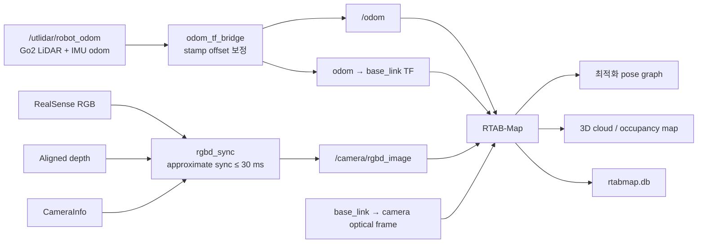

# Go2 RTAB-Map 아키텍처

## 목적과 범위

이 저장소는 Unitree Go2의 LiDAR/IMU odometry와 RealSense RGB-D를 RTAB-Map에 연결해 실내 지도 작성과 재로컬라이제이션을 수행한다. Visual 경로는 외부 odom을 초기 자세 예측으로 사용하고, RGB-D 시각 정합으로 인접 링크와 공간 proximity 및 loop closure 제약을 계산한다.

이 문서는 `visual_slam.launch.py`와 `rtabmap_visual_real.yaml`을 기준으로 한다.

## Visual SLAM 데이터 흐름



`odom_tf_bridge`는 첫 Go2 odom 메시지에서 `now - sensor_stamp` clock epoch offset을 계산하고 이후 메시지에 같은 값을 적용한다. 여기에 카메라 회전과 실제 bridge `/odom`을 함께 기록해 측정한 `sensor_time_offset_sec=-0.015`를 더한다. 음수이므로 최종 odom stamp는 epoch 보정 결과보다 15ms 앞당겨진다. 메시지의 위치와 자세는 수정하지 않으므로 `/odom`의 yaw drift 자체는 이 브리지에서 제거되지 않는다.

### 카메라–odom 시간 오프셋 검증

2026-07-20 전용 rosbag은 47.03초 동안 color image 1,407개, raw Go2 odom 7,036개, bridge `/odom` 7,049개를 기록했다. 영상 optical flow 회전 신호와 `/odom` 회전 신호의 상관계수는 최대 **0.9926**이었다. `/odom.twist.angular.z` 기준 최적 offset은 -8~-11ms, RTAB-Map pose와 직접 관련된 quaternion yaw 변화 기준은 약 -19ms였다. 두 신호와 30Hz 카메라의 시간 해상도를 고려해 `sensor_time_offset_sec=-0.015`를 채택했다.

이 residual offset은 Go2 clock epoch를 맞추는 기존 `now - sensor_stamp`와 별개다. visual mapping과 localization launch는 기본값 -0.015초를 bridge에 주입하며, `odom_sensor_time_offset_sec:=<seconds>` launch 인자로 덮어쓸 수 있다. 이는 빠른 회전의 미세 정렬을 개선하기 위한 값으로, graph optimization이나 원본 Go2 odom yaw drift를 대신 보정하지 않는다.

## 겹침 현상 해결

### 최초 증상과 원인 구분

정적인 물체와 방 전체를 여러 위치에서 관찰하면 point cloud가 서로 다른 자세에 놓여 물체가 두 개로 보이고 벽과 가구가 겹치는 현상이 발생했다. 움직이는 물체를 잘못 누적한 문제가 아니라, 동일한 정적 장면을 촬영한 각 node의 pose가 서로 일치하지 않는 문제였다.

Go2 odom만 사용하면 짧은 구간에서도 yaw와 병진 오차가 RGB-D cloud 자세에 그대로 들어간다. 반대로 visual transform만 인접 node마다 계속 누적하면 작은 PnP 오차가 긴 경로에서 전역 drift로 커진다. 따라서 해결 과정은 근거리 정합과 전역 graph 일관성을 따로 검증했다.

### 1차 개선: PnP neighbor refinement와 처리율 상향

먼저 다음 세 설정을 함께 적용했다.

| 변경 | 목적 |
|---|---|
| `Vis/EstimationType: 2 → 1` | scale이 불안정한 2D→2D epipolar transform 대신 RGB-D metric depth를 쓰는 3D→2D PnP 사용 |
| `RGBD/NeighborLinkRefining: false → true` | Go2 odom으로 생성된 연속 node 사이 상대 자세를 PnP로 다시 정제 |
| `Rtabmap/DetectionRate: 1 Hz → 5 Hz → 8 Hz` | 5 Hz로 1차 개선한 뒤 8 Hz 전체 루프까지 검증해, 회전 중 프레임 사이 각도와 시야 변화를 줄이고 PnP 특징점 중첩을 유지 |

1 Hz DB에서는 인접 링크 49개 중 11개가 refinement에 실패했고, 프레임 사이 회전이 30° 이상인 세 구간은 모두 실패했다. 3D→2D PnP와 neighbor refinement 및 5 Hz를 적용한 뒤 짧은 구간의 명확한 이중상이 크게 줄었고, 이후 8 Hz 전체 루프 검증을 통과해 현재 기본값은 8 Hz로 확정했다.

### 큰 루프에서 다시 겹친 이유

크게 한 바퀴 돈 뒤에는 장면 전체가 다시 겹쳤다. DB의 재방문 이미지를 별도 ORB+RGB-D PnP와 dense depth ICP로 대조한 결과, loop closure는 실제 같은 장소끼리 연결된 정상 제약이었다. 문제는 잘못된 loop closure가 아니라 다음 두 조건의 조합이었다.

1. 156개의 refined neighbor edge를 연속 적분한 경로가 검증된 loop constraint와 **61–83cm, 7.9–11.9°** 불일치했다.
2. 실제 loop closure 10개가 대부분 출발점으로 돌아온 구간에 집중돼, 주행 중간 경로에는 전역 오차를 묶어 줄 비인접 제약이 부족했다.

graph optimizer는 끝에서 들어온 정상 loop closure를 만족시키기 위해 긴 neighbor chain의 오차를 전체 경로에 재분배했다. 그 과정에서 일부 node가 최대 약 60.6cm/11.5° 이동했고, 동일한 정적 장면의 cloud가 서로 다른 위치에 놓여 다시 큰 겹침으로 보였다.

### 2차 개선: 중간 spatial proximity 제약 추가

`RGBD/ProximityBySpace=true`를 켜 현재 추정 위치 주변의 비인접 과거 node와도 visual registration을 수행하게 했다. 이는 마지막 복귀 지점의 global loop closure만 기다리지 않고, 기존 경로 가까이 지날 때 주행 중간에도 local spatial proximity 제약을 graph에 추가하는 방식이다. `RGBD/ProximityOdomGuess=false`는 유지해 proximity transform을 Go2 odom guess로 강제하지 않았다.

이 변경은 이전 refined-neighbor 기준에서 공간 proximity만 추가한 통제 실험이었다. 대표 주행에서는 visual spatial detection 11개가 추가됐고, 긴 neighbor chain과 loop 사이 불일치가 위치 중앙값 약 80.0cm에서 26.0cm로, 회전 중앙값 8.77°에서 3.47°로 감소했다. 이후 주행에서도 proximity 제약이 분산 생성되면서 물체가 명확히 두 개로 보이는 **큰 이중상**은 사라지거나 크게 줄었다.

큰 겹침에 대해 검증한 graph 설정은 그대로 유지하고 처리율을 5 Hz에서 8 Hz로 올린 뒤, 부분 주행과 전체 루프에서 처리 성능과 최종 지도를 검증했다. 현재 최종 채택한 기본값은 다음과 같다.

```yaml
Kp/DetectorStrategy: 8  # GFTT detector + ORB descriptor
Vis/FeatureType: 8      # GFTT/ORB visual registration features
Vis/EstimationType: 1
RGBD/NeighborLinkRefining: true
RGBD/ProximityBySpace: true
RGBD/ProximityOdomGuess: false
Rtabmap/DetectionRate: 8.0  # 5 Hz → 8 Hz 검증 완료 기본값
```

### 8 Hz 전체 루프 검증

2026-07-20 전체 루프 주행은 8.53m를 46.82초 동안 이동했고, 입력 통계 349개와 최적화 대상 지도 node 96개를 생성했다. 설정값은 8.0 Hz였으며 실제 입력 간격은 주로 약 133ms로, 실효 처리율 **7.43 Hz**를 기록했다. RTAB-Map 처리시간은 중앙값 38.31ms, p95 58.79ms였고 125ms 처리 예산을 넘은 경우는 348개 중 1개뿐이어서 처리 병목은 없었다.

neighbor refinement는 95회 중 90회 성공했다. 마지막 global loop closure는 node 241과 59를 visual match 314개와 **194개 inlier**로 연결했다. 최적화 전 긴 neighbor chain과 이 closure 사이 차이는 26.4cm/7.85°로, 과거 큰 겹침 주행의 61–83cm/7.9–11.9°보다 병진 drift가 감소했다. 최적화 후 neighbor constraint 잔차 p95는 0.82mm/0.20°였고, 전체 장면이 두 겹으로 보이던 현상은 육안으로 재현되지 않았다. 따라서 8 Hz는 실험 후보가 아니라 현재 visual SLAM의 검증 완료 기본값으로 채택한다.

이 전체 루프에서는 `RGBD/ProximityBySpace=true`였지만 local spatial proximity link가 생성되지 않았고 global closure 1개만 생성됐다. 즉 이번 성공은 8 Hz 입력에서 유지된 neighbor PnP chain과 마지막 global closure의 결과다. proximity 설정은 이전 부분 재방문 주행에서 실제 분산 제약을 추가한 이력이 있으므로 계속 활성화하지만, 경로와 추정 위치에 따라 항상 링크가 생성되는 것은 아니다. 또한 refinement가 실패한 node 222→225 edge 한 곳에는 최적화 후 2.27cm/7.18°의 국소 잔차가 집중됐다. 큰 이중상은 없었지만 이와 같은 저특징 구간은 얇은 국소 왜곡의 원인이 될 수 있다.

### 남은 경계 번짐

큰 이중상이 줄어든 뒤에도 물체 윤곽이 얇게 퍼지는 **경계 번짐**은 남았다. 빠른 주행 DB에서는 흐린 RGB 프레임과 4–7cm급 국소 graph 잔차가 함께 나타났고, 천천히 움직인 주행에서는 영상 선명도 중앙값이 43.1에서 61.1로 증가하면서 neighbor 잔차 p95가 4.24cm/1.45°에서 0.88cm/0.26°로 감소했다. 따라서 남은 현상은 큰 loop 실패보다 회전 모션 블러, 프레임 간 이동량, depth 경계 노이즈 및 아직 검증하지 않은 camera extrinsic의 영향을 받는 얇은 표면 오차로 구분한다.

수동 color exposure를 166에서 100으로 줄인 실험은 자세 잔차 일부를 줄였지만 feature inlier와 영상 선명도를 함께 개선하지 못해 최종 해결책으로 채택하지 않았다. 카메라 노출은 원래 상태로 복구했다. graph 관련 설정을 고정하고 `Rtabmap/DetectionRate`만 **5 Hz → 8 Hz**로 변경한 통제 실험과 전체 루프 검증에서 처리 여유와 큰 겹침 해소를 확인했으므로, 현재 코드는 8.0 Hz를 기본값으로 유지한다.

## Pose graph와 RGB-D 보정

각 RTAB-Map 노드는 다음 순서로 자세를 결정한다.

1. `/odom`으로 현재 `base_link` 자세를 예측한다.
2. `RGBD/NeighborLinkRefining=true`가 연속 노드 사이 상대 자세를 3D→2D PnP로 정제한다.
3. `RGBD/ProximityBySpace=true`가 현재 추정 위치 주변의 비인접 과거 노드를 찾아 추가 visual constraint를 시도한다.
4. global loop closure가 검출되면 PnP로 비인접 노드 사이 제약을 추가한다.
5. graph optimizer가 neighbor, proximity 및 loop 제약을 함께 사용해 최종 지도 자세를 계산한다.

핵심 Visual 파라미터는 다음과 같다.

| 파라미터 | 값 | 역할 |
|---|---:|---|
| `Reg/Strategy` | `0` | Visual registration 사용 |
| `Kp/DetectorStrategy` | `8` | Global loop closure 후보 검색용 GFTT 검출점과 ORB descriptor를 명시적으로 고정 |
| `Vis/FeatureType` | `8` | Neighbor, proximity 및 loop link의 visual registration용 GFTT/ORB를 명시적으로 고정 |
| `Vis/EstimationType` | `1` | depth가 있는 이전 특징점과 현재 2D 특징점을 이용하는 3D→2D PnP |
| `Vis/MinInliers` | `20` | visual transform을 승인할 최소 inlier 수 |
| `RGBD/NeighborLinkRefining` | `true` | 인접 edge를 PnP로 정제해 Go2 odom의 단기 자세 오차를 완화 |
| `RGBD/ProximityBySpace` | `true` | 공간적으로 가까운 비인접 노드 사이에 분산 visual constraint를 시도 |
| `RGBD/ProximityOdomGuess` | `false` | proximity 정합에 Go2 odom motion guess를 강제하지 않아 실험 변수를 분리 |
| `Rtabmap/DetectionRate` | `8.0 Hz` | 전체 루프 검증을 마친 visual 처리 기본값 |
| `RGBD/LinearUpdate` | `0.1 m` | 새 지도 노드 생성을 위한 최소 병진 변화 |
| `RGBD/AngularUpdate` | `0.1 rad` | 새 지도 노드 생성을 위한 최소 회전 변화 |

`Vis/EstimationType=1`은 RGB-D의 metric depth를 사용하는 PnP 방식이다. 기존의 `Vis/EstimationType=2`는 2D→2D epipolar geometry라서 거의 정지한 구간이나 순수 회전에 가까운 구간에서 translation scale과 loop transform이 불안정해질 수 있다.

`Kp/DetectorStrategy=8`과 `Vis/FeatureType=8`은 현재 RTAB-Map 빌드에서 사용되던 기본 GFTT/ORB 조합을 설정 파일에 명시적으로 고정한 것이다. GFTT가 추적하기 좋은 corner를 검출하고 ORB binary descriptor가 노드 사이 대응점을 식별한다. 전자는 global loop closure 후보 검색에, 후자는 PnP 기반 link transform 계산에 사용된다. 빌드 옵션에 따라 RTAB-Map 기본 feature type이 달라질 수 있으므로 재현 가능한 실행을 위해 두 값을 생략하지 않는다.

`RGBD/NeighborLinkRefining=false` 통제 주행에서는 시작 직후부터 장면 겹침이 재현됐다. 해당 clean DB에는 실제로 `false`가 저장됐고, 31초 동안 생성된 regular node는 20개였다. 검출된 재방문 제약은 같은 정적 장면끼리 연결됐으며 graph 최적화 이동량도 최대 약 4cm/0.43°에 불과했다. 따라서 이 짧은 주행의 즉시 겹침은 잘못된 loop closure가 아니라 Go2 odom만 사용한 인접 자세가 RGB-D cloud 정렬에 충분하지 않다는 증거다. 현재 실험은 `RGBD/NeighborLinkRefining=true`로 되돌려 근거리 PnP 정렬을 유지한다.

그러나 refinement를 켠 동일한 큰 루프의 clean DB에서는 저장된 loop closure가 별도 ORB+RGB-D PnP 및 dense depth ICP와 대체로 수 cm 이내로 일치한 반면, 156개의 PnP-refined neighbor edge를 순서대로 적분하면 검증된 loop closure에 대해 **61–83cm**, **7.9–11.9°**의 불일치가 누적됐다. 같은 구간의 원시 Go2 odom loop 불일치는 **16–27cm**, **1.0–2.6°**로 더 작았다. 즉 PnP neighbor refinement는 근거리에는 필요하지만 하나의 긴 chain만으로 사용하면 전역 drift가 누적될 수 있다.

`RGBD/ProximityBySpace=true`는 로봇이 기존 node 가까이 지날 때 비인접 visual link를 주행 중간에도 추가한다. 이 분산 제약은 PnP neighbor chain 오차가 마지막 loop closure까지 누적되는 것을 줄인다. `RGBD/ProximityOdomGuess=false`는 proximity transform 계산에 Go2 odom guess를 강제하지 않는다. 기존 경로 가까이 지나지 않거나 drift 때문에 후보가 검색 반경 밖으로 벗어나면 proximity link가 생성되지 않아 효과가 없을 수 있다.

`Rtabmap/DetectionRate=8.0`은 빠른 회전에서 visual 입력 간격을 줄이는 검증 완료 기본값이다. 1 Hz로 수집한 실기 DB에서는 인접 링크 49개 중 11개가 visual refinement에 실패했고, 인접 영상 사이 회전이 30° 이상인 세 구간은 모두 실패했다. 이 결과를 근거로 1 Hz → 5 Hz를 먼저 적용한 뒤, 같은 neighbor/proximity/PnP 설정에서 5 Hz → 8 Hz를 검증했다. 전체 루프에서는 실효 7.43 Hz, 처리시간 p95 58.79ms를 기록해 125ms 예산 안에서 안정적으로 동작했고 큰 겹침도 재현되지 않았다. 지도 노드 생성 기준인 `RGBD/LinearUpdate=0.1 m`와 `RGBD/AngularUpdate=0.1 rad`는 그대로이므로, 처리 빈도를 올리는 것과 불필요한 regular 지도 노드를 늘리는 것은 구분된다.

## 좌표계와 TF 소유권

의도된 TF 트리는 다음과 같다.

```text
map                              RTAB-Map
└── odom                         RTAB-Map의 map 보정
    └── base_link                odom_tf_bridge
        └── camera_link          visual launch의 static TF
            └── camera optical frame   RealSense driver
```

- `map → odom`: RTAB-Map이 graph optimization 결과로 발행한다.
- `odom → base_link`: `odom_tf_bridge` 하나만 발행해야 한다.
- `base_link → camera_link`: 카메라 장착 extrinsic을 사용하며, 현재 값의 정밀 실측 검증은 남아 있다.
- `camera_link → optical frame`: RealSense driver가 발행한다.

동일한 TF edge를 둘 이상의 노드가 발행하면 자세가 튈 수 있으므로 각 edge의 authority는 하나로 유지한다.

## Occupancy와 3D 지도

Aligned depth로 노드별 local occupancy grid를 생성한다.

| 파라미터 | 값 |
|---|---:|
| `Grid/RangeMin` | `0.3 m` |
| `Grid/RangeMax` | `3.0 m` |
| `Grid/DepthDecimation` | `2` |
| `Grid/CellSize` | `0.05 m` |
| `RGBD/CreateOccupancyGrid` | `true` |

각 노드의 depth cloud는 최적화된 노드 자세로 `map` 프레임에 조립된다. 따라서 지도 겹침은 point cloud 누적 자체보다 각 노드에 적용된 pose가 실제 촬영 pose와 다를 때 발생한다.

## Go2 odom yaw drift와 보정 범위

실기 clean DB의 정지 구간에서 Go2 odom은 약 360초 동안 약 5.74°의 yaw drift를 보였다. 이 값이 `RGBD/AngularUpdate=0.1 rad` 임계값을 넘으면서 동일한 정적 장면이 새 키프레임으로 생성됐다.

현재 visual 설정은 다음 범위에서 이 문제를 완화한다.

- PnP neighbor refinement로 Go2 odom의 단기 상대 자세 오차를 완화한다.
- 공간 proximity constraint로 주행 중간의 비인접 node 사이에 분산된 보정점을 시도한다.
- metric PnP loop constraint로 2D→2D scale 불확실성을 피하고 전역 drift를 보정한다.
- 최적화된 지도와 `map → odom`은 보정되지만 원본 `/utlidar/robot_odom`과 `odom → base_link`의 drift는 그대로 남는다.
- odom drift가 node 생성 임계값을 넘으면 불필요한 중복 노드는 계속 생성될 수 있다.

장시간 주행과 Nav2의 local odom 정확도까지 안정화하려면 upstream Go2 odom의 yaw bias 보정, sensor fusion 또는 별도 visual/VIO odometry가 추가로 필요하다.

## Mapping과 localization

### Mapping

- `Mem/IncrementalMemory=true`
- 기본 DB: `maps/visual/active/rtabmap.db`
- `reset_db=true`일 때만 기존 DB를 삭제한다.
- RGB-D PnP neighbor, spatial proximity 및 loop closure constraint로 graph를 지속적으로 최적화한다.

### Localization

- `Mem/IncrementalMemory=false`
- `Mem/InitWMWithAllNodes=true`
- 기존 DB를 삭제하지 않고 불러온다.
- 새 지도를 누적하지 않고 입력 RGB-D를 기존 visual graph에 정합한다.

## 주요 구현 파일

- `src/go2_rtabmap_bridge/go2_rtabmap_bridge/odom_tf_bridge.py`: Go2 odom stamp 보정과 odom TF 발행
- `src/go2_rtabmap_launch/launch/visual_slam.launch.py`: Visual mapping 노드 구성
- `src/go2_rtabmap_launch/launch/visual_localization.launch.py`: Visual localization 노드 구성
- `src/go2_rtabmap_launch/config/rtabmap_visual_real.yaml`: RGB-D sync, visual registration, graph 및 grid 파라미터
