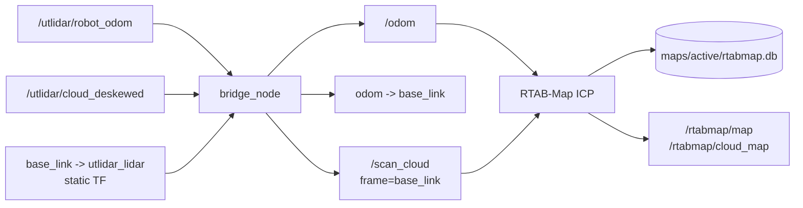
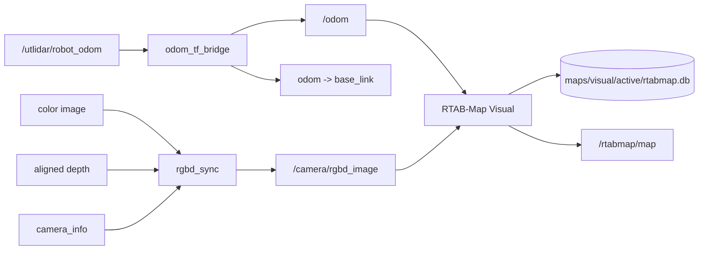
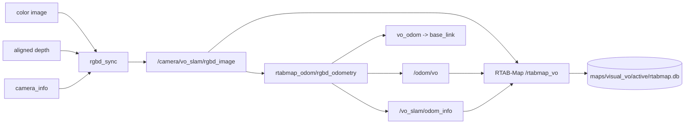

# 시스템 아키텍처와 설계 결정

이 문서는 현재 코드가 제공하는 세 SLAM 모듈의 구조와 차이를 설명한다. 실행 방법은
[OPERATIONS](OPERATIONS.md), 실험 근거는 [VALIDATION](VALIDATION.md), 센서 특성은
[GO2_REFERENCE](GO2_REFERENCE.md), 장애 대응은
[TROUBLESHOOTING](TROUBLESHOOTING.md)을 참고한다.

## 세 모듈 한눈에 보기

| 구분 | LiDAR SLAM | Go2 odom 기반 Visual SLAM | 순수 Visual SLAM |
|---|---|---|---|
| 주 센서 | Go2 내장 LiDAR | Go2 odom + RealSense RGB-D | RealSense RGB-D |
| odometry 주체 | Go2 `/utlidar/robot_odom` | Go2 `/utlidar/robot_odom` | `rtabmap_odom/rgbd_odometry` |
| 정규화 odom | `/odom` | `/odom` | `/odom/vo` |
| 지역 TF 소유자 | `bridge_node`: `odom -> base_link` | `odom_tf_bridge`: `odom -> base_link` | `rgbd_odometry`: `vo_odom -> base_link` |
| RTAB-Map 입력 | `/odom` + `/scan_cloud` | `/odom` + `/camera/rgbd_image` | `/odom/vo` + `/camera/vo_slam/rgbd_image` + `/vo_slam/odom_info` |
| 등록 전략 | ICP, `Reg/Strategy=1` | Visual, `Reg/Strategy=0` | Visual, `Reg/Strategy=0` |
| 기본 DB | `maps/active/rtabmap.db` | `maps/visual/active/rtabmap.db` | `maps/visual_vo/active/rtabmap.db` |
| mapping | 지원 | 지원 | 지원 |
| localization | 지원 | 지원 | 전용 launch 없음 |
| Nav2 통합 | 없음 | 지원 | 없음 |

세 모듈은 RTAB-Map과 RGB-D 일부 설정을 공유하지만 서로 대체 가능한 실행 옵션이
아니다. 특히 odometry와 TF 발행자를 동시에 실행하면 같은 child frame을 여러 노드가
소유할 수 있으므로 한 번에 하나의 모듈만 실행해야 한다.

## 공통 좌표계와 저장 원칙

모든 모듈은 로봇 body frame으로 `base_link`, 전역 frame으로 `map`을 사용한다.
RTAB-Map은 odometry가 제공하는 지역 frame 위에 graph optimization 결과를 반영하는
전역 보정 관계를 제공한다.

```text
LiDAR / Go2 odom Visual
map -> odom -> base_link -> sensor frame

Pure Visual
map -> vo_odom -> base_link -> camera_link
```

카메라 정적 TF의 현재 launch 기본값은 다음과 같다.

```text
base_link -> camera_link
x=0.34 m, y=0.0 m, z=0.095 m
roll=0.0, pitch=0.0, yaw=0.0 rad
```

이 값은 코드에 고정된 운용 기본값이지 정밀 재측정이 끝난 calibration 결과를
의미하지 않는다.

세 mapping launch는 `reset_db:=false`가 기본이다. `reset_db:=true`를 지정하면 선택한
`rtabmap.db`와 같은 이름의 `-shm`, `-wal`, `-journal` sidecar만 삭제한다. 서로 다른
모듈의 DB 경로를 분리해 실험 결과가 덮어써지지 않도록 한다.

## 모듈 A: LiDAR SLAM

### 목적

Go2 내장 LiDAR가 제공하는 odometry와 deskewed point cloud를 ROS 2와 RTAB-Map이
안정적으로 사용할 수 있는 형태로 정규화한다. 카메라 없이 LiDAR 기반 3D mapping과
기존 DB localization을 수행하는 경로다.

### 데이터 흐름



### `bridge_node` 책임

`go2_rtabmap_bridge/bridge_node.py`는 odom과 cloud를 함께 처리한다.

1. 첫 odom message에서 `ROS now - sensor stamp` epoch offset을 한 번 계산한다.
2. 같은 offset을 이후 odom과 cloud stamp에 적용해 두 센서의 상대 시간 관계를
   유지한다.
3. Go2 odom pose를 `/odom`으로 재발행하고 `odom -> base_link` TF를 발행한다.
4. cloud의 corrected time으로 source frame에서 `base_link`까지 TF를 조회한다.
5. exact-time lookup이 실패하면 최신 TF가 corrected time에서 `0.2 s` 이내일 때만
   fallback으로 사용한다.
6. `x=y=z=intensity=0`인 PointCloud2 padding point만 제거한다.
7. 나머지 point record layout은 유지한 채 xyz를 변환해 `/scan_cloud`로 발행한다.

입력 odom 구독은 RELIABLE, 입력 cloud 구독은 BEST_EFFORT다. `/odom`과
`/scan_cloud` 출력은 RELIABLE이다. 첫 odom offset이 준비되기 전에 들어온 cloud,
frame id가 비어 있는 cloud, 허용 범위 안의 TF를 얻지 못한 cloud는 발행하지 않는다.

입력 이름이 `/utlidar/cloud_deskewed`인 것처럼 deskew는 Go2 upstream에서 수행된다.
이 브리지는 cloud 내부 각 point의 시간을 다시 사용하지 않고 message 전체에 하나의
rigid transform을 적용한다.

### LiDAR RTAB-Map

`rtabmap_lidar_indoor.yaml`은 RGB, depth와 scan 구독을 끄고 `scan_cloud`만 켠다.
주요 현재값은 다음과 같다.

| 항목 | 값 | 의미 |
|---|---:|---|
| `Reg/Strategy` | `1` | ICP 기반 등록 |
| `Reg/Force3DoF` | `false` | Go2 odom과 cloud의 6DoF 유지 |
| `Icp/PointToPlane` | `true` | point-to-plane ICP |
| `Icp/VoxelSize` | `0.05` | ICP voxel 크기 |
| `Icp/MaxCorrespondenceDistance` | `0.3` | mapping correspondence 상한 |
| `Rtabmap/DetectionRate` | `5` | RTAB-Map 처리율 |
| `RGBD/LinearUpdate` | `0.05` | node 생성 이동 기준 |
| `RGBD/AngularUpdate` | `0.05` | node 생성 회전 기준 |
| `approx_sync_max_interval` | `0.03` | odom-cloud 동기 허용 간격 |

현재 mapping 기본값은 Go2 odom을 안정적인 지역 운동 추정으로 사용하며
`RGBD/NeighborLinkRefining`, `RGBD/ProximityBySpace`,
`RGBD/ProximityOdomGuess`를 모두 끈 odom-only graph baseline이다.

### Mapping과 localization

`slam.launch.py`는 다음을 함께 시작한다.

- `base_link -> utlidar_lidar` 정적 TF
- `bridge_node`
- `/rtabmap` namespace의 `rtabmap_slam/rtabmap`
- 선택적 RViz와 `rtabmap_viz`

mapping에서는 `Mem/IncrementalMemory=true`, `Mem/InitWMWithAllNodes=false`다.

`localization.launch.py`는 시작 전에 DB 파일 존재를 검사한다. localization에서는
`Mem/IncrementalMemory=false`, `Mem/InitWMWithAllNodes=true`로 기존 graph를 로드하고
선택적 `initial_pose`를 받는다. 현재 localization override는 spatial proximity를
사용하지만 odom guess와 global scan map은 끄고, 근접 후보 수와 ICP acceptance를
별도로 제한한다. 이 구성은 초기 위치를 모르는 완전한 global relocalization보다
초기 위치가 알려진 localization에 더 적합하다.

## 모듈 B: Go2 odom 기반 Visual SLAM

### 목적

Go2 내장 odometry를 지역 운동 추정으로 유지하면서 RealSense RGB-D의 visual
constraint, loop closure와 depth occupancy를 RTAB-Map에 추가한다. odometry를
카메라로 다시 계산하는 구조가 아니라 Go2 odom과 RGB-D mapping을 결합한 구조다.

### 데이터 흐름



### Go2 odom 정규화

`odom_tf_bridge.py`는 기본적으로 `/utlidar/robot_odom`을 받아 `/odom`과
`odom -> base_link`를 발행한다. 첫 message에서 epoch offset을 계산하는 방식은 LiDAR
브리지와 같지만 Visual launch는 카메라와 odom의 잔여 시간 차이에 대한
`sensor_time_offset_sec=-0.015`를 추가한다. 음수 값이므로 epoch 보정 후 odom stamp를
15 ms 앞당긴다.

`visual_slam.launch.py`는 `planarize_odom:=false`가 기본이어서 z, roll, pitch를 포함한
Go2 pose를 그대로 사용한다. mapping에서 이 인자를 `true`로 지정하면 `/odom`과
`odom -> base_link`를 x, y, yaw 평면 운동으로 바꾼다. 현재
`visual_localization.launch.py`는 이 planarize 인자를 노출하지 않는다.

### RGB-D 동기화와 등록

두 Visual launch의 기본 입력은 다음과 같다.

```text
/camera/color/image_raw
/camera/aligned_depth_to_color/image_raw
/camera/color/camera_info
              |
              v
        /camera/rgbd_image
```

`rtabmap_sync/rgbd_sync`는 approximate sync와 최대 `0.03 s` 간격을 사용한다.
RTAB-Map 쪽 queue는 빠른 Go2 odom과 지연된 RGB-D를 수용하도록 각각 100으로
설정돼 있다.

`rtabmap_visual_real.yaml`의 핵심은 다음과 같다.

| 항목 | 값 | 의미 |
|---|---:|---|
| `Reg/Strategy` | `0` | visual registration |
| `Reg/Force3DoF` | `false` | 6DoF visual constraint |
| `Kp/DetectorStrategy` | `8` | GFTT detector |
| `Vis/FeatureType` | `8` | ORB descriptor |
| `Vis/EstimationType` | `1` | 3D-to-2D PnP |
| `Vis/MinInliers` | `20` | constraint 최소 inlier |
| `RGBD/NeighborLinkRefining` | `true` | 인접 odom edge를 visual constraint로 refinement |
| `RGBD/ProximityBySpace` | `true` | 공간 근접 후보 활성화 |
| `RGBD/ProximityOdomGuess` | `false` | proximity registration에 odom guess 미사용 |
| `Rtabmap/DetectionRate` | `8.0` | mapping 기본 처리율 |

Go2 odom은 pose 초기 추정을 제공하지만 RTAB-Map graph에는 RGB-D 특징점과 depth로
계산한 neighbor, proximity, loop constraint가 추가될 수 있다.

### 2D occupancy grid

현재 설정은 aligned depth에서 Nav2가 사용할 2D local occupancy를 만든다.

- `RGBD/CreateOccupancyGrid=true`
- `Grid/Sensor=1`, `Grid/3D=false`, `Grid/RayTracing=true`
- 범위 `0.3-3.0 m`, cell `0.05 m`, depth decimation `2`
- 최대 obstacle 높이 `0.20 m`
- noise radius `0.10 m`, 최소 neighbor `5`

ray tracing은 카메라와 obstacle 사이의 관측 free space를 기록한다. 이 설정은
RTAB-Map의 `/rtabmap/map`을 global costmap 입력으로 사용하기 위한 현재 계약이다.

### Mapping과 localization

`visual_slam.launch.py`는 Go2 odom bridge, camera static TF, RGB-D sync와 RTAB-Map을
시작한다. mapping은 `Mem/IncrementalMemory=true`,
`Mem/InitWMWithAllNodes=false`, detection rate `8.0 Hz`가 기본이다.

`visual_localization.launch.py`는 `database_path`를 필수로 받고 파일 존재를 검사한다.
DB 삭제는 기본적으로 꺼져 있다. localization은 다음 override를 사용한다.

- `Mem/IncrementalMemory=false`, `Mem/InitWMWithAllNodes=true`
- `Rtabmap/DetectionRate=2.0`
- `RGBD/LinearUpdate=0.05`, `RGBD/AngularUpdate=0.05`
- `RGBD/ProximityBySpace=true`, `RGBD/ProximityOdomGuess=true`

mapping과 localization의 처리율 및 update 기준은 의도적으로 다르다.

### 상위 운용 모드와 Nav2

`go2_nav2_bringup`은 이 모듈 위에 두 가지 top-level mode를 제공한다.

`visual_mapping_mode.launch.py`는 `visual_slam.launch.py`만 include한다. Nav2와 PC의
Sport command bridge를 시작하지 않으므로 공식 조종기로 로봇을 움직이며 mapping하는
모드다.

`visual_navigation_mode.launch.py`는 다음을 조합한다.

- 기존 DB를 사용하는 `visual_localization.launch.py`
- aligned depth를 `/scan`으로 바꾸는 `depthimage_to_laserscan`
- AMCL과 `nav2_map_server` 없이 `/rtabmap/map`을 사용하는 Nav2
- Omni motion model의 MPPI controller와 velocity smoother
- `/lowstate -> /joint_states`, `robot_state_publisher`, 선택적 RViz
- `/cmd_vel -> /api/sport/request` Sport command bridge

Nav2 global costmap은 `/rtabmap/map`, local costmap은 depth 기반 `/scan`을 사용한다.
속도 경계는 전진 `1.0 m/s`, 후진 `-0.5 m/s`, 횡이동 `+-0.4 m/s`, 회전
`+-1.0 rad/s`이며 controller, velocity smoother와 Sport bridge에 같은 경계가
적용된다.

`enable_motion=false`가 기본이다. 이 상태에서 Sport bridge는 `/cmd_vel`을 실제
Unitree request로 발행하지 않는다. 실제 이동을 허용하면 Move API `1008`을 사용하고,
zero command, 잘못된 숫자, `0.30 s` timeout 또는 종료 시 필요한 경우 StopMove API
`1003`을 발행한다.

## 모듈 C: 순수 Visual SLAM

### 목적과 범위

Go2 odometry를 사용하지 않고 RealSense RGB-D만으로 odometry와 RTAB-Map mapping을
구성한다. Go2 odom 기반 Visual SLAM과 DB, odom frame, topic, namespace를 분리해 두
경로가 충돌하지 않게 한다.

현재 코드는 mapping launch만 제공한다. 순수 Visual DB를 다시 여는 전용
localization launch나 Nav2 통합은 구현돼 있지 않다.

### 데이터 흐름과 TF 소유권



`rgbd_odometry`가 `publish_tf=true`로 `vo_odom -> base_link`를 직접 소유한다. 이
모듈에서는 `odom_tf_bridge`와 `/utlidar/robot_odom`을 시작하거나 구독하지 않는다.
RTAB-Map은 별도 `/rtabmap_vo` namespace에서 동작하며 visual odometry가 발행한
odom, 같은 RGB-D message와 odom diagnostics를 구독한다.

### Visual Odometry 설정

`rgbd_odometry_vo.yaml`은 다음 baseline을 고정한다.

| 항목 | 값 |
|---|---:|
| `frame_id` | `base_link` |
| `odom_frame_id` | `vo_odom` |
| `Odom/Strategy` | `0` |
| `Odom/ResetCountdown` | `0` |
| `Vis/FeatureType` | `8` |
| `Vis/MinInliers` | `20` |
| `Vis/MinDepth` | `0.3` |
| `Vis/MaxDepth` | `4.0` |

RGB-D sync 결과 하나를 VO와 RTAB-Map이 공유하므로 두 consumer가 서로 다른 frame
pairing을 사용하지 않는다. VO가 tracking을 잃으면 이 모듈의 지역 odometry와 SLAM
입력이 동시에 영향을 받는다.

### RTAB-Map 설정과 DB

`rtabmap_visual_vo.yaml`은 RGB-D와 odom diagnostics를 구독하고 visual registration을
사용한다. mapping은 `Mem/IncrementalMemory=true`,
`Mem/InitWMWithAllNodes=false`다. detection rate `8.0 Hz`, neighbor refinement와
spatial proximity는 Go2 odom Visual 설정에서 분리된 이 파일에 별도로 고정돼 있다.

depth 기반 occupancy 생성을 켜며 범위는 `0.3-3.0 m`, cell은 `0.05 m`다. 현재 이
config에는 Go2 odom Visual 설정과 달리 `Grid/3D=false`, ray tracing, obstacle-height
filter가 명시돼 있지 않다. 따라서 두 모듈의 occupancy 결과가 같다고 가정하면 안 된다.

## 보조 비교 도구

`vo_odom_comparison.launch.py`는 Go2 odom과 RGB-D visual odometry를 같은 실행에서
서로 다른 topic과 frame으로 만든다. `odom_initial_alignment_tf`는 시간 차이가 기본
`0.05 s` 이내인 첫 유효 pose pair를 선택해 `odom_compare` 아래 두 odom 원점을
평면 정렬한다. `analyze_odom_bag`은 bag의 두 Odometry topic을 상대 pose로 바꿔
CSV와 JSON 요약을 생성한다.

이 도구는 두 odometry를 비교하기 위한 것이며 세 SLAM 모듈의 TF와 동시에 실행하는
top-level mode가 아니다.

## 패키지 책임

| 패키지 | 책임 |
|---|---|
| `go2_rtabmap_bridge` | LiDAR 입력 정규화, Go2 odom 정규화, odom 비교·분석 도구 |
| `go2_rtabmap_launch` | 세 SLAM 경로의 RTAB-Map launch와 YAML |
| `go2_nav2_bringup` | Go2 odom Visual mapping 및 localization+Nav2 top-level mode |
| `go2_nav2_control` | 안전 경계를 적용한 Sport command bridge와 live joint bridge |
| `dashboard` | LiDAR mapping/localization 프로세스 제어용 보조 Web UI |

## 현재 지원 범위와 한계

- LiDAR SLAM은 mapping과 known-start에 가까운 localization을 지원하지만 완전한
  kidnapped-robot global relocalization을 보장하지 않는다.
- Go2 odom 기반 Visual SLAM은 mapping, localization과 Nav2를 지원한다. visual
  constraint는 Go2 odom drift를 graph에서 보정할 수 있지만 카메라 조명, motion blur,
  depth 경계와 extrinsic 오차의 영향을 받는다.
- 순수 Visual SLAM은 독립 mapping baseline이다. tracking 지속성은 RGB-D 품질에
  직접 의존하며 전용 localization과 Nav2는 현재 범위 밖이다.
- 세 모듈 모두 실기 모션 전에는 DB, TF, topic, localization과 planning을 정지 상태에서
  먼저 확인해야 한다.
