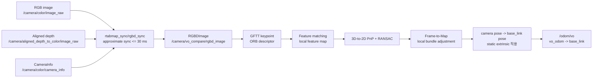

# Go2 RGB-D Visual Odometry 구성 정리

## 1. 문서 목적

이 문서는 현재 `vo_odom_comparison.launch.py`에서 생성하는 Visual
Odometry(VO)의 전체 데이터 흐름과 실제로 적용되는 추정·보정 알고리즘을
정리한다.

현재 VO는 RTAB-Map SLAM이 아니라 `rtabmap_odom/rgbd_odometry`만 사용한다.
따라서 지도 생성, loop closure, global graph optimization은 수행하지 않는다.

핵심 출력은 다음과 같다.

```text
topic:          /odom/vo
header.frame_id: vo_odom
child_frame_id:  base_link
rate:            약 30 Hz
```

VO는 카메라 영상으로 움직임을 추정하지만 최종 출력 pose는 카메라 자체가
아니라 `base_link`의 pose다.

## 2. 전체 데이터 흐름



## 3. 입력 센서와 RealSense 설정

### 3.1 입력 토픽

| 데이터 | 토픽 | 용도 |
|---|---|---|
| RGB | `/camera/color/image_raw` | 특징점 검출과 descriptor 계산 |
| Aligned depth | `/camera/aligned_depth_to_color/image_raw` | RGB 특징점의 metric 3D 위치 계산 |
| CameraInfo | `/camera/color/camera_info` | 카메라 내부 파라미터 적용 |

### 3.2 현재 카메라 프로파일

실행 중인 `/camera/camera` 파라미터에서 확인한 값이다.

```text
RGB:   848 x 480 @ 30 Hz
Depth: 848 x 480 @ 30 Hz
RGB-Depth synchronization: enabled
Aligned depth: enabled
RGB global timestamp: enabled
Depth global timestamp: enabled
Depth emitter: enabled
Laser power: 150
```

CameraInfo에서 확인한 주요 값:

```text
frame_id: camera_color_optical_frame
fx: 605.8435668945312
fy: 605.6947021484375
cx: 419.64251708984375
cy: 257.2354431152344
distortion_model: plumb_bob
```

Aligned depth를 사용하므로 depth pixel은 RGB pixel 좌표계에 정렬된 상태로
VO에 전달된다. CameraInfo의 내부 파라미터는 RGB 특징점과 depth를 metric
3D 점으로 변환할 때 사용된다.

### 3.3 현재 RealSense depth 필터 상태

| RealSense 처리 | 상태 |
|---|---|
| Align depth | 활성 |
| Stream synchronization | 활성 |
| Depth emitter | 활성 |
| Spatial filter | 비활성 |
| Temporal filter | 비활성 |
| Hole-filling filter | 비활성 |
| Decimation filter | 비활성 |
| Disparity filter | 비활성 |
| HDR merge | 비활성 |

현재 depth는 RGB 좌표계로 정렬되지만 공간·시간 smoothing이나 hole filling은
적용되지 않는다. 따라서 유효하지 않은 depth와 frame별 depth noise가 그대로
RTAB-Map 입력으로 들어올 수 있다.

### 3.4 IMU 상태

현재 RealSense 설정에서는 다음 스트림이 비활성이다.

```text
enable_accel: false
enable_gyro: false
```

VO launch도 IMU 토픽을 `rgbd_odometry`에 연결하지 않는다. 따라서 현재
VO는 visual-inertial odometry가 아니라 RGB-D visual odometry다.

## 4. RGB-D 동기화

`rtabmap_sync/rgbd_sync`가 RGB, aligned depth, CameraInfo를 하나의
`rtabmap_msgs/msg/RGBDImage`로 묶는다.

현재 설정:

| 파라미터 | 값 | 의미 |
|---|---:|---|
| `approx_sync` | `true` | 완전히 동일하지 않은 timestamp도 허용 |
| `approx_sync_max_interval` | `0.03` s | 최대 30 ms 이내 입력만 동기화 |
| `queue_size` | `20` | 입력 queue 크기 |
| `sync_queue_size` | `20` | 동기화 queue 크기 |
| `qos_image` | `1` | 이미지 Sensor Data QoS |
| `qos_camera_info` | `1` | CameraInfo Sensor Data QoS |

출력:

```text
/camera/vo_compare/rgbd_image
```

RealSense의 `enable_sync`와 aligned depth가 이미 활성화되어 있고,
`rgbd_sync`가 최대 30 ms 제한으로 다시 묶는 구조다.

## 5. Visual Odometry 추정 단계

### 5.1 특징점 검출

현재 특징점 방식:

```text
Vis/FeatureType = 8
8 = GFTT detector + ORB descriptor
```

세부 기본값:

| 파라미터 | 값 | 의미 |
|---|---:|---|
| `Vis/MaxFeatures` | `1000` | 프레임당 최대 특징점 |
| `GFTT/QualityLevel` | `0.001` | GFTT quality threshold |
| `GFTT/MinDistance` | `7` px | 특징점 간 최소 거리 |
| `GFTT/BlockSize` | `3` | GFTT block 크기 |
| `ORB/NLevels` | `3` | ORB pyramid level |
| `ORB/ScaleFactor` | `2` | pyramid scale |
| `ORB/PatchSize` | `31` | ORB descriptor patch |
| `ORB/EdgeThreshold` | `19` | 영상 경계 제외 영역 |

`Vis/FeatureType=8`은 현재 launch에서 명시하지만 설치된 RTAB-Map의 기본값도
동일하다.

### 5.2 Depth 유효 영역 적용

```text
Vis/DepthAsMask = true
```

유효한 depth가 있는 영상 영역을 특징점 검출 mask로 사용한다.

현재 비교 VO는 실내 RGB-D PnP에 사용할 특징점을 다음 거리로 제한한다.

```text
Vis/MinDepth = 0.3 m
Vis/MaxDepth = 4.0 m
```

첫 baseline bag에서는 두 값이 기본값 `0`이어서 거리 제한이 없었다. 이후
비교 실험부터 너무 가까운 depth 경계와 먼 거리의 불안정한 depth를 PnP
특징점에서 제외한다. 이 값은 VO 비교 노드에만 적용되며 Visual SLAM의
지도 생성 범위는 변경하지 않는다.

### 5.3 특징점 correspondence

```text
Vis/CorType = 0
0 = descriptor feature matching
```

현재 frame의 GFTT/ORB 특징점과 Frame-to-Map local feature map의 특징점을
descriptor로 매칭한다. Optical Flow 방식은 사용하지 않는다.

### 5.4 이동 transform 계산

```text
Vis/EstimationType = 1
1 = 3D-to-2D PnP
```

이전 keyframe/local map에 저장된 metric 3D 특징점과 현재 RGB 영상의 2D
특징점 correspondence로 카메라 이동을 계산한다.

PnP 설정:

| 파라미터 | 값 | 의미 |
|---|---:|---|
| `Vis/PnPFlags` | `0` | Iterative PnP |
| `Vis/Iterations` | `300` | 최대 RANSAC/PnP 반복 |
| `Vis/PnPReprojError` | `2` px | reprojection inlier threshold |
| `Vis/MinInliers` | `20` | transform을 수용할 최소 inlier |
| `Vis/PnPRefineIterations` | `0` | 별도 PnP refine 비활성 |
| `Vis/PnPMaxVariance` | `0` | PnP variance 제한 비활성 |
| `Vis/MinInliersDistribution` | `0` | inlier 공간 분포 검사 비활성 |

PnP와 RANSAC은 잘못 매칭된 특징점 correspondence를 제거하는 1차 보정
역할을 한다.

`Vis/MinInliers=20`도 현재 launch에서 명시하지만 설치된 RTAB-Map 기본값과
같다.

### 5.5 Frame-to-Map odometry

```text
Odom/Strategy = 0
0 = Frame-to-Map
```

현재 frame을 직전 한 frame과만 비교하는 Frame-to-Frame 방식이 아니라,
최근 keyframe들에서 유지하는 local feature map과 비교한다.

주요 설정:

| 파라미터 | 값 | 의미 |
|---|---:|---|
| `OdomF2M/MaxSize` | `2000` | local map 최대 visual word 수 |
| `Odom/KeyFrameThr` | `0.3` | inlier 비율이 기준보다 낮아지면 새 keyframe |
| `OdomF2M/ValidDepthRatio` | `0.75` | depth 없는 점을 local map에 추가할 때의 조건 |

Frame-to-Map 방식은 짧은 구간에서 여러 keyframe의 특징점을 재사용하므로
Frame-to-Frame보다 추정이 안정적일 수 있다. 그러나 SLAM loop closure나
전체 주행 경로의 global optimization은 아니다.

### 5.6 Local bundle adjustment

현재 local bundle adjustment는 활성 상태다.

```text
OdomF2M/BundleAdjustment = 1
1 = g2o
OdomF2M/BundleAdjustmentMaxFrames = 10
```

최근 최대 10개 frame의 camera pose와 feature geometry를 local하게
최적화한다. 이 보정은 최근 local map의 일관성을 개선하지만 전체 궤적의
누적 drift를 닫거나 loop closure를 수행하지 않는다.

### 5.7 Motion prediction

```text
Odom/GuessMotion = true
Odom/GuessSmoothingDelay = 0
```

직전에 계산한 motion으로 다음 frame의 초기 transform을 예측한다. Motion
prediction 자체는 활성화되어 있지만 여러 frame의 속도를 평균내는 guess
smoothing은 적용하지 않는다.

### 5.8 Camera pose를 base_link pose로 변환

RTAB-Map은 RGB-D camera frame에서 motion을 추정한 뒤 TF extrinsic을
사용해 `base_link` pose로 변환한다.

현재 비교 launch가 발행하는 고정 transform:

```text
base_link -> camera_link

x:     0.34 m
y:     0.0 m
z:     0.095 m
roll:  0 rad
pitch: 0 rad
yaw:   0 rad
```

RealSense가 제공하는 다음 TF 연결은 실제로 존재하는 것을 확인했다.

```text
camera_link -> camera_color_optical_frame
```

전체 chain:

```text
base_link
  -> camera_link
    -> camera_color_frame
      -> camera_color_optical_frame
```

주의할 점은 `base_link -> camera_link` 값이 현재 수동 입력한 장착 위치라는
것이다. 카메라가 실제로 roll, pitch 또는 yaw 방향으로 기울어져 있다면 현재
회전값 `0`은 잘못된 extrinsic이다. 이 경우 카메라 전후 이동이 로봇의
Z 또는 횡방향 이동으로 잘못 변환될 수 있다.

### 5.9 VO 메시지 발행

현재 출력:

```text
topic: /odom/vo
message type: nav_msgs/msg/Odometry
header.frame_id: vo_odom
child_frame_id: base_link
publish_tf: false
```

`publish_tf=false`는 Go2 odometry와 동일한 `base_link`에 서로 다른 odom
TF가 동시에 연결되는 충돌을 막기 위한 설정이다. TF 발행을 끄는 것은 VO
추정 계산 자체에는 영향을 주지 않는다.

## 6. 현재 활성화된 보정·안정화 항목

| 보정·안정화 기능 | 상태 | 역할 |
|---|---|---|
| RGB-Depth hardware synchronization | 활성 | RGB와 depth 입력 시간 일치 |
| Aligned depth | 활성 | depth를 RGB pixel 좌표로 변환 |
| CameraInfo intrinsics | 활성 | 2D pixel과 metric 3D 점 변환 |
| Depth validity mask | 활성 | 유효 depth 영역에서 특징점 사용 |
| Descriptor feature matching | 활성 | frame-local map 특징점 correspondence |
| PnP RANSAC | 활성 | 잘못된 correspondence 제거 |
| 최소 20 inlier 검사 | 활성 | 약한 transform 거부 |
| Feature depth 범위 | `0.3–4.0 m` | 너무 가깝거나 먼 depth 특징점 제외 |
| Frame-to-Map local map | 활성 | 여러 keyframe 특징점 재사용 |
| g2o local bundle adjustment | 활성 | 최근 pose와 feature geometry 보정 |
| Previous motion guess | 활성 | 다음 pose 추정 초기값 제공 |
| Camera-to-base extrinsic | 활성 | camera motion을 base_link motion으로 변환 |

## 7. 현재 비활성인 보정·제약 항목

| 기능 | 현재 값 | 영향 |
|---|---:|---|
| Odometry output filtering | `Odom/FilteringStrategy=0` | raw VO pose가 smoothing 없이 출력됨 |
| Kalman filtering | 비활성 | frame별 위치 흔들림을 별도로 완화하지 않음 |
| Particle filtering | 비활성 | particle 기반 pose smoothing 없음 |
| 3DoF planar constraint | `Reg/Force3DoF=false` | Z, roll, pitch를 포함한 6DoF를 자유롭게 추정 |
| Ground alignment | `Odom/AlignWithGround=false` | 초기 pose를 지면 방향으로 정렬하지 않음 |
| IMU input | 비활성 | roll/pitch gravity 기준이 없음 |
| Visual-inertial gravity constraint | 비활성 | 카메라 흔들림을 중력 방향으로 제한하지 않음 |
| RealSense spatial filter | 비활성 | depth 공간 노이즈 smoothing 없음 |
| RealSense temporal filter | 비활성 | depth frame 간 시간 smoothing 없음 |
| RealSense hole filling | 비활성 | depth hole 보간 없음 |
| Inlier spatial distribution check | 비활성 | 한 영역에 몰린 inlier도 허용 가능 |
| PnP variance rejection | 비활성 | transform variance 기반 거부 기준 없음 |
| Automatic odom reset | `Odom/ResetCountdown=0` | 연속 실패 후 자동 원점 reset 없음 |
| Go2 odom motion prior | 비활성 | Go2 움직임을 VO 초기값으로 사용하지 않음 |
| Go2 + VO sensor fusion | 비활성 | 두 odometry를 EKF 등으로 융합하지 않음 |
| Loop closure | 없음 | 이전 장소 재인식으로 drift를 보정하지 않음 |
| Global graph optimization | 없음 | 전체 주행 궤적 최적화 없음 |

## 8. 현재 VO 성격

현재 구성은 다음과 같이 요약할 수 있다.

```text
기본 RTAB-Map RGB-D 6DoF VO
[ON]  GFTT/ORB feature matching
[ON]  PnP/RANSAC
[ON]  visual feature depth 0.3–4.0 m
[ON]  Frame-to-Map local feature map
[ON]  g2o local bundle adjustment
[ON]  previous motion prediction
[ON]  CameraInfo와 aligned depth
[ON]  camera-to-base extrinsic
[OFF] output smoothing
[OFF] planar 3DoF constraint
[OFF] IMU/gravity correction
[OFF] depth spatial/temporal filtering
[OFF] Go2 prior 또는 sensor fusion
[OFF] loop closure/global optimization
```

즉 VO 계산이나 local optimization이 빠진 상태는 아니지만, 출력 pose를
부드럽게 만드는 temporal filter와 평면 이동 제약, 중력 보정은 사용하지
않는다.

현재 launch에서 명시한 visual parameter는 다음과 같다. Depth 범위 두 값은
설치된 RTAB-Map 기본값 `0`(제한 없음)에서 변경한 비교 실험값이다.

```text
Vis/FeatureType = 8
Vis/MinInliers = 20
Vis/MinDepth = 0.3
Vis/MaxDepth = 4.0
```

나머지 PnP 분산, inlier 분포, gravity와 출력 filtering은 아직 기본값이므로
현재 VO는 depth 범위만 통제한 첫 번째 튜닝 단계다.

## 9. 현재 관측된 흔들림과 설정의 관계

Depth 범위 적용 전 첫 baseline rosbag에서 확인한 값:

```text
VO effective rate: 약 29.86 Hz
VO max output gap: 약 66.7 ms
0.5초 이상 tracking gap: 0회
position difference RMSE: 약 0.239 m
maximum position difference: 약 0.450 m
final position difference: 약 0.265 m
VO Z range: 약 0.366 m
Go2 Z range: 약 0.073 m
```

VO는 출력이 끊기지는 않았지만 Go2보다 frame별 위치 변화와 Z축 변동이
크게 관측됐다.

baseline 설정에서 이 현상과 관련될 수 있었던 항목:

1. `Odom/FilteringStrategy=0`이므로 frame별 raw pose가 그대로 보인다.
2. `Reg/Force3DoF=false`이므로 Z, roll, pitch가 자유롭게 변한다.
3. IMU가 없어 gravity 기준으로 roll/pitch를 고정하지 않는다.
4. RealSense depth spatial/temporal filter가 꺼져 있다.
5. 특징점 depth의 최소·최대 거리 제한이 없었다. 현재 비교 실험에서는
   `0.3–4.0 m`로 제한해 효과를 검증한다.
6. inlier가 영상 한 영역에 몰려도 별도 분포 기준으로 거르지 않는다.
7. 실제 camera mount pitch/roll과 launch extrinsic이 다를 수 있다.
8. Go2의 보행 진동과 카메라 motion blur가 RGB 특징점에 직접 반영될 수 있다.

이 목록은 가능한 원인 후보이며 아직 하나의 원인으로 확정한 것은 아니다.
설정을 바꾸기 전에 `/odom_info`와 실제 장착 extrinsic을 측정해야 한다.

## 10. `/odom_info`로 확인할 진단 값

`rgbd_odometry`는 `/odom/vo`와 함께 `/odom_info`를 발행한다.

주요 필드:

| 필드 | 확인 내용 |
|---|---|
| `lost` | 현재 frame에서 odometry 추정 실패 여부 |
| `features` | 검출된 특징점 개수 |
| `matches` | local map과 매칭된 특징점 개수 |
| `inliers` | PnP/RANSAC을 통과한 inlier 개수 |
| `local_map_size` | Frame-to-Map local feature map 크기 |
| `local_key_frames` | local optimization의 keyframe 수 |
| `local_bundle_outliers` | local bundle adjustment outlier 수 |
| `local_bundle_constraints` | bundle adjustment constraint 수 |
| `local_bundle_avg_inlier_distance` | local BA 평균 inlier 거리 |
| `key_frame_added` | 현재 frame의 keyframe 추가 여부 |
| `time_estimation` | VO pose 계산 시간 |
| `covariance` | 추정 pose 불확실성 |
| `gravity_roll_error` | gravity roll 오차, 현재 IMU 미사용 |
| `gravity_pitch_error` | gravity pitch 오차, 현재 IMU 미사용 |
| `transform` | 현재 계산된 raw transform |
| `transform_filtered` | filtering 적용 transform, 현재 filtering 비활성 |
| `guess` | motion prediction 초기값 |
| `type` | `0=Frame-to-Map`, `1=Frame-to-Frame` |

실행 중 확인:

```bash
ros2 topic hz /odom_info
ros2 topic echo /odom_info
```

정지, 느린 직진, 제자리 회전, 빠른 회전 조건에서 `/odom_info`를 기록하면
다음 문제를 구분할 수 있다.

```text
features 감소
  -> 조명, motion blur, 저특징 환경 후보

matches는 많지만 inliers 감소
  -> 잘못된 feature matching 또는 depth geometry 문제 후보

inliers는 충분하지만 covariance 증가
  -> 기하학적 관측 조건 또는 depth noise 후보

lost=true
  -> transform 계산 실패

inliers 정상 + Z/roll/pitch만 흔들림
  -> 6DoF 자유도, gravity 부재, extrinsic 후보
```

## 11. 다음 검증 순서

설정을 한꺼번에 바꾸지 않고 다음 순서로 원인을 분리한다.

1. `base_link -> camera_link` 실측 위치와 roll/pitch/yaw 검증
2. 정지·직진·회전 중 `/odom_info` 기록
3. features, matches, inliers, covariance와 pose 흔들림 시간 비교
4. RGB motion blur와 aligned depth hole/noise 확인
5. 원인이 확인된 뒤 한 가지 설정만 변경해 재실험

후보 실험은 다음과 같이 분리한다.

```text
실험 A: 현재 기본값
실험 B: 정확한 camera extrinsic만 적용
실험 C: planar 3DoF constraint만 적용
실험 D: depth range 또는 depth filter 한 가지만 적용
실험 E: odometry output filtering만 적용
```

각 실험에서 같은 경로를 주행하고 `/odom/vo`, `/odom/go2`, `/odom_info`를
동시에 기록해야 원인과 효과를 구분할 수 있다.

## 12. 관련 파일

| 파일 | 역할 |
|---|---|
| `src/go2_rtabmap_launch/launch/vo_odom_comparison.launch.py` | RGB-D VO와 비교용 Go2 odom 실행 |
| `src/go2_rtabmap_bridge/go2_rtabmap_bridge/odom_comparison.py` | 첫 pose 정렬과 궤적 차이 계산 |
| `src/go2_rtabmap_bridge/go2_rtabmap_bridge/analyze_odom_bag.py` | rosbag 분석과 CSV/JSON 생성 |
| `results/vo_go2_samples.csv` | 첫 실험의 timestamp별 비교 결과 |
| `results/vo_go2_summary.json` | 첫 실험의 비교 요약 |

현재 설정의 기준 파일은
`src/go2_rtabmap_launch/launch/vo_odom_comparison.launch.py`다.
